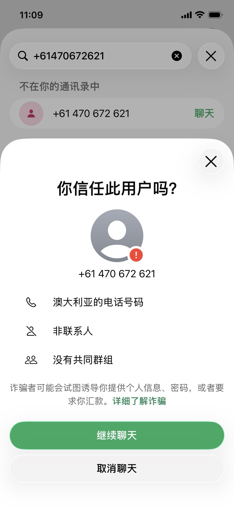
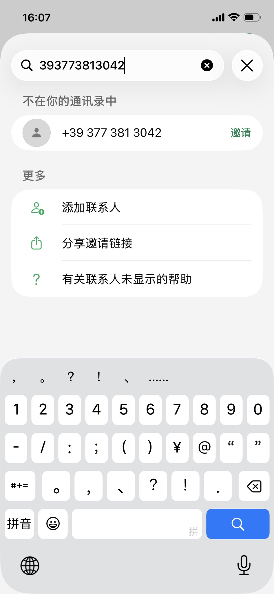

# 不信任号码是什么？有什么影响？

分类：[重要]风控相关
更新时间：2026-09-23T17:13:05+08:00

**本文说明不信任标记的含义、影响、恢复情况，以及需要重点注意的互动行为。**

## 一、不信任标记是什么

这个状态在不同的人打开你的对话时，可能出现不同结果，常见有以下三种：

1. <strong class="doc-blue-strong">不弹出提示</strong>。
2. <strong class="doc-blue-strong">弹出官方提示</strong>。
3. <strong class="doc-blue-strong">账号明明在线，但对方搜索不到你的号码</strong>。

这些结果由 WhatsApp 官方实时返回，可能因查看账号、时间或官方状态不同而变化。当你的账号被 WhatsApp 官方标记为<strong class="doc-blue-strong">【不信任】</strong>后，客户打开与你的聊天界面时，可能会看到如下官方提示。

### “疑似销号”是什么意思

如果页面显示<strong class="doc-blue-strong">【疑似销号】</strong>，通常对应第三种情况：<strong class="doc-blue-strong">账号明明在线，但对方搜索不到你的号码</strong>。这表示官方返回的状态可能还没有完全同步，不一定代表账号已经真正注销。

> **遇到“疑似销号”时，可以等待几分钟后重新进行一次信任检测，以确认账号是否已经变为【不信任】或恢复正常。**

## 二、不信任标记有什么影响

不信任标记是当前版本需要重点关注的风控信号，与频繁封禁、扫号封禁、永久封禁等问题密切相关。

> **不要只看账号是否在线或是否已解封，还需要关注账号是否被官方标记为【不信任】。**

检测方法请参考：[如何进行信任检测](../星辰Whatsapp使用手册V2.0/如何进行信任检测.md)。

## 三、不信任标记会解除吗

目前对<strong class="doc-blue-strong">5 万个号码</strong>的测试观察中，解除不信任标记的号码<strong class="doc-blue-strong">不到 10 个</strong>，即观察比例不到万分之二（0.02%）。

> **恢复情况极少，不应把解除不信任标记作为后续使用账号的预期。以上为当前样本的观察结果，不代表恢复保证。**

相关状态由官方收集数据后判断。现有检测手段只能查询结果，<strong class="doc-blue-strong">无法查询官方具体的标记原因</strong>。

## 四、哪些行为可能触发不信任标记

根据目前的观察，以下行为都可能触发官方判断是否标记账号：

1. **通过链接批量加群**：每次加群，官方都会判断一次是否需要标记。
2. **添加好友**：每次添加好友，官方都会判断一次是否需要标记。
3. **上传通讯录**：每次上传，官方都会判断一次是否需要标记。
4. **大量接粉**：每个粉丝的互动都可能触发一次官方判断。
5. **主动私聊**：每条主动私聊消息，官方都会判断一次是否需要标记。

## 五、哪些情况属于主动私聊

### 没有绿盾，或账号复接后主动联系

没有绿盾时主动联系对方，属于主动私聊。账号复接后，<strong class="doc-blue-strong">即使又有绿盾</strong>，也需要按主动私聊对待。

### 有共同群，且登录后收到对方在群内发言

按当前观察，需要同时满足以下条件：

1. <strong class="doc-blue-strong">与对方有共同群</strong>。
2. <strong class="doc-blue-strong">账号登录后，对方已在共同群内发言</strong>。
3. <strong class="doc-blue-strong">在对方发言后，再私聊对方</strong>。

这种情况下，不按上述主动私聊情形判断。

### 有共同群，但对方未在群内发言

如果只是与对方有共同群，对方没有在共同群里发言，你就主动私聊对方，<strong class="doc-blue-strong">仍属于主动私聊</strong>。

> **仅有共同群不等于可以主动私聊。这是目前较常见、重复操作较多的风险行为，需要特别注意。**
