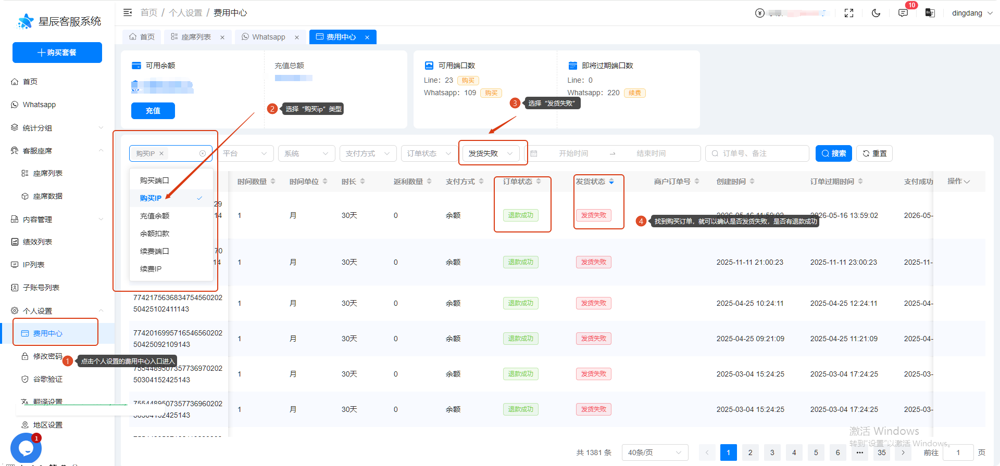

# IP 没发货应该怎么办

分类：常见问题
更新时间：2026-05-26T00:00:00+08:00
ID：62f3fdfe249504460c4921d5

如果购买 IP 后没有正常发货，先到费用中心查看对应订单的发货和退款状态。

## 操作步骤

1. 进入【个人设置】中的【费用中心】。
2. 在费用中心选择对应的 IP 购买类型。
3. 找到发货失败的订单，查看订单是否已经发货失败，以及是否已经退款成功。

如果订单显示发货失败但退款状态不明确，或者你无法确认订单状态，可以按统一提问格式反馈对应订单截图，方便进一步查证。
