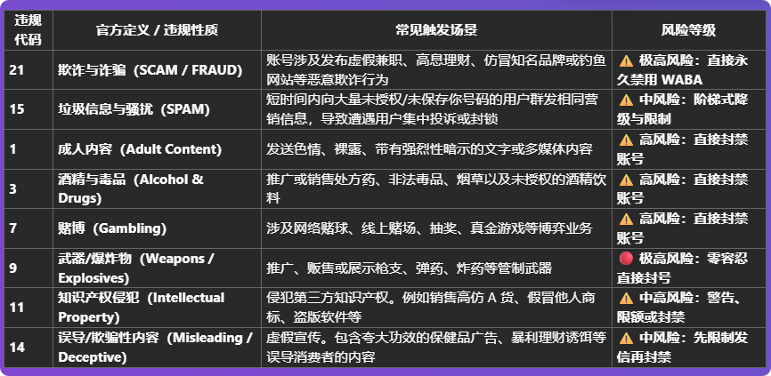

# 为什么我的号码解封超过1天

分类：常见问题
更新时间：2026-05-20T23:06:03+08:00
ID：4cdbbb52f226f7030f1d3595

**如果号码申请解封超过 1 天仍未恢复，通常说明该账号被官方判定为较高等级风控，处理时间会比普通封禁更长。**

> 结论：超过一天不能解封的账号，一般可能被官方判定为“欺诈”等较高封禁等级，属于永封前的高等级风控。即使一个月不能解封，也属于可能出现的情况。

## 一、为什么会超过 1 天还没解封

普通封禁可能较快得到结果，但高等级风控不会固定在 1 天内完成处理。

常见原因：

1. 账号被官方判定为较高风险。
2. 账号触发了更严格的审核流程。
3. 账号封禁等级接近永久封禁。
4. 官方没有明确承诺固定解封时间。

## 二、超过 1 天是否代表异常

不一定。超过 1 天未解封，不代表星辰没有提交申请，也不代表流程异常。解封结果和处理时长以官方审核为准。

可能出现的情况：

1. 几天后解封。
2. 长时间保持解封中。
3. 最终无法解封。
4. 被判定为永久封禁。

## 三、应该怎么处理

1. 按正常流程继续查看解封状态。
2. 不要频繁重复提交相同申请。
3. 如果账号长期无法恢复，按业务情况准备替代账号。
4. 如果账号最终永久封禁，可根据需要使用永封继承继续处理会话。

## 四、官方封禁等级参考

以下为官方封禁等级参考：

