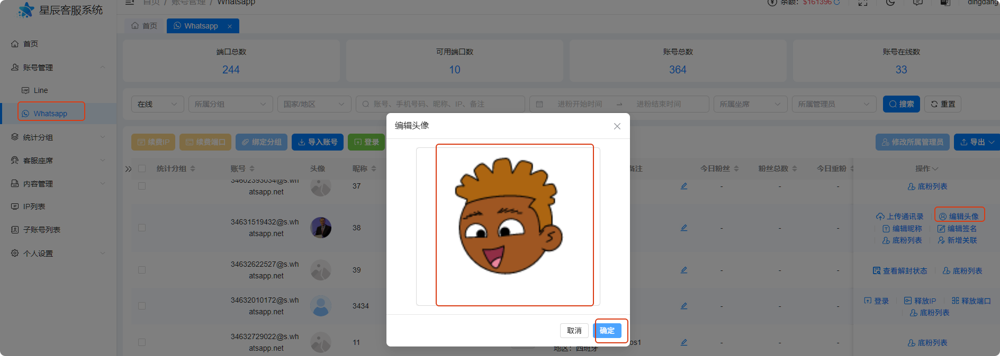
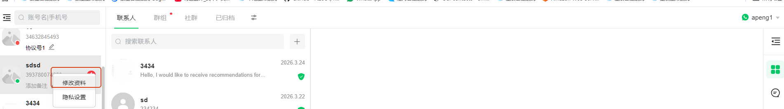
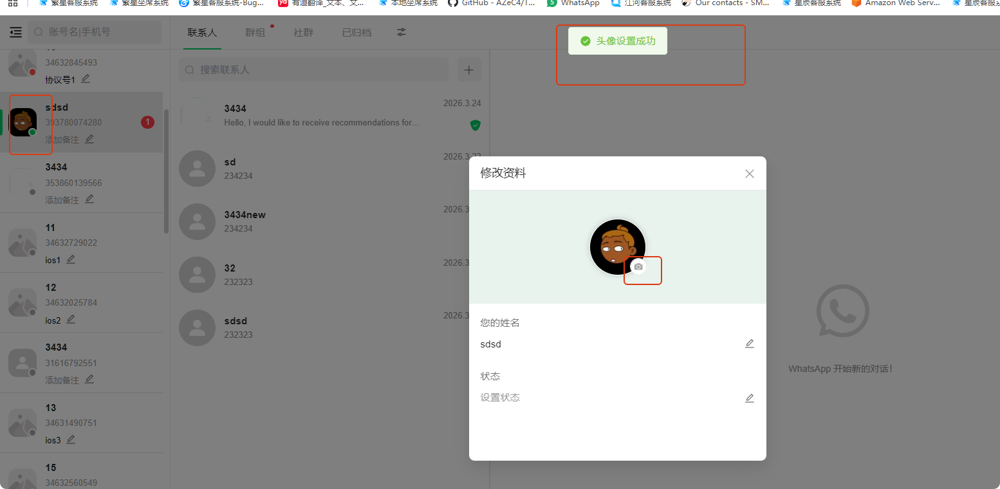

# 为什么我的头像经常“消失”

分类：常见问题
更新时间：2026-05-20T23:26:20+08:00
ID：4dcffb42881078e696792326

**头像经常“消失”，通常是因为当前看到的是缓存头像或临时头像。缓存过期后，如果账号没有正式设置头像，页面就会显示为没有头像。**

> 建议：账号每次登录到星辰后，不管页面当前有没有显示头像，都重新设置一次头像。

## 一、为什么头像会消失

账号和星辰产生交互后，页面可能会显示临时头像。如果登录前该账号曾经和星辰上的账号有过互动，系统可能缓存过头像，因此登录时看起来像是已经有头像。

但这种头像不一定是账号正式设置的头像，可能只是缓存结果。缓存有有效期，过期后就会出现头像消失的情况。

常见表现：

1. 登录时看到有头像，但过一段时间头像消失。
2. 自己页面还能看到头像，其他页面或其他账号看不到。
3. 头像来自缓存，并不是账号正式上传的头像。

## 二、如何避免头像消失

星辰和手机端一样，账号登录后建议手动设置头像。每次登录后，即使当前页面已经显示头像，也建议重新上传并确认一次。

这样可以让头像变成账号正式设置的头像，而不是依赖临时缓存。

## 三、方式一：后台设置头像

1. 账号登录成功后，进入账号列表。
2. 点击【编辑头像】。
3. 上传需要使用的头像图片。
4. 点击【确认】保存。

## 四、方式二：坐席系统设置头像

1. 登录坐席系统。
2. 找到需要修改头像的账号。
3. 右键点击该账号，选择【修改资料】。

4. 在修改资料弹窗中点击头像按钮。
5. 选择需要上传的头像图片。
6. 保存后完成头像修改。

> 提示：如果头像再次消失，请优先重新上传头像，不要只依赖页面上暂时显示的缓存头像。
