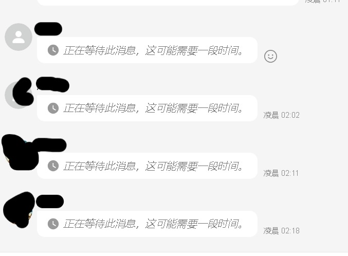

# 为什么解封后看不到消息（消息不能解密）

分类：常见问题
更新时间：2026-05-22T10:55:00+08:00
ID：ea107f14108e37be0264001f

**账号解封后，如果封号期间收到的离线消息无法显示，或提示消息不能解密，通常是官方端到端加密机制导致的结果。**

> 结论：封号期间产生的离线消息不一定都能解密，是否能恢复只以官方机制为准。包括官方 App、江河、星辰在内，都没有任何方式可以强制解密已经无法解密的离线消息。

## 一、为什么会出现这种情况

WhatsApp 消息采用端到端加密。账号被封期间，账号状态、设备连接、密钥同步等环节都可能受到影响。

因此，解封后可能出现以下情况：

1. 部分离线消息可以正常显示。
2. 部分离线消息无法解密。
3. 对方已经发送过消息，但当前账号看不到具体内容。
4. 页面提示消息不能解密或需要等待重新同步。

这种情况【不是星辰主动拦截消息】，也【不是通过后台操作就能恢复的内容】。

## 二、能不能通过技术手段解密

不能。

离线消息能否解密，取决于官方的端到端加密和密钥同步结果。只要官方没有为当前账号提供可用的解密条件，星辰也无法绕过官方机制读取消息内容。

需要注意：

1. 可以用自己的其他号码收发消息，验证当前账号的消息收发功能是否正常。
2. 对于显示消息延迟的粉丝，后续消息是否正常，要以账号解封并恢复在线后的实际收发为准。也就是说，需要引导粉丝重新发送消息，才能判断在线后是否正常。
3. 如果粉丝重新发送后仍然解密失败，但其他号码给你发消息都能正常解密，说明粉丝那边也产生了端到端加密问题，这种情况没有额外方法可以解决。
