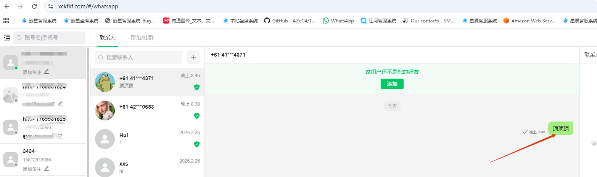
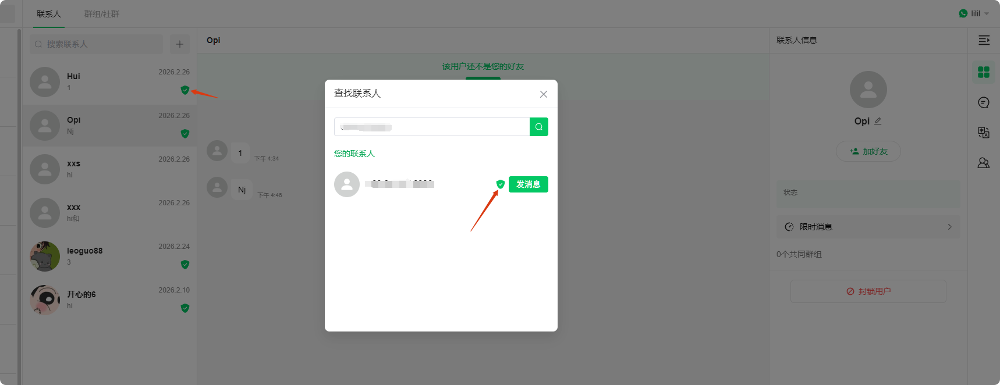
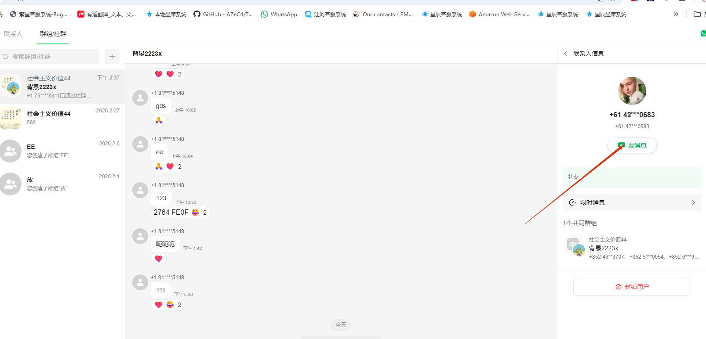
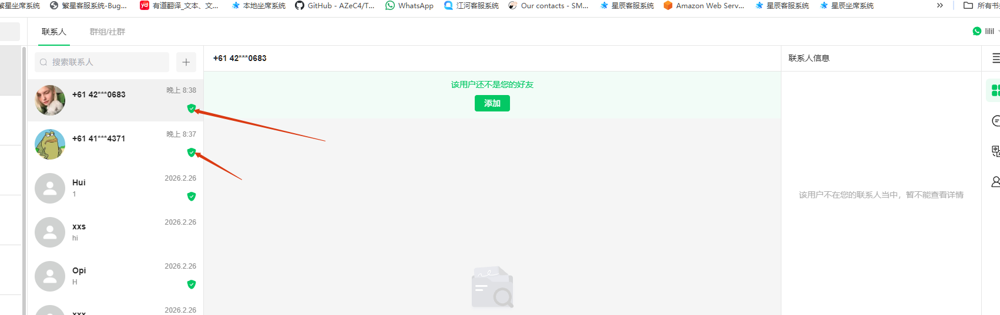
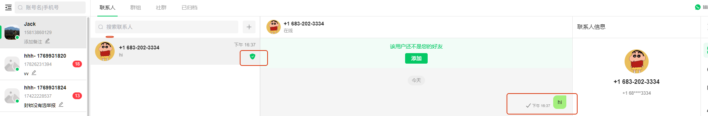
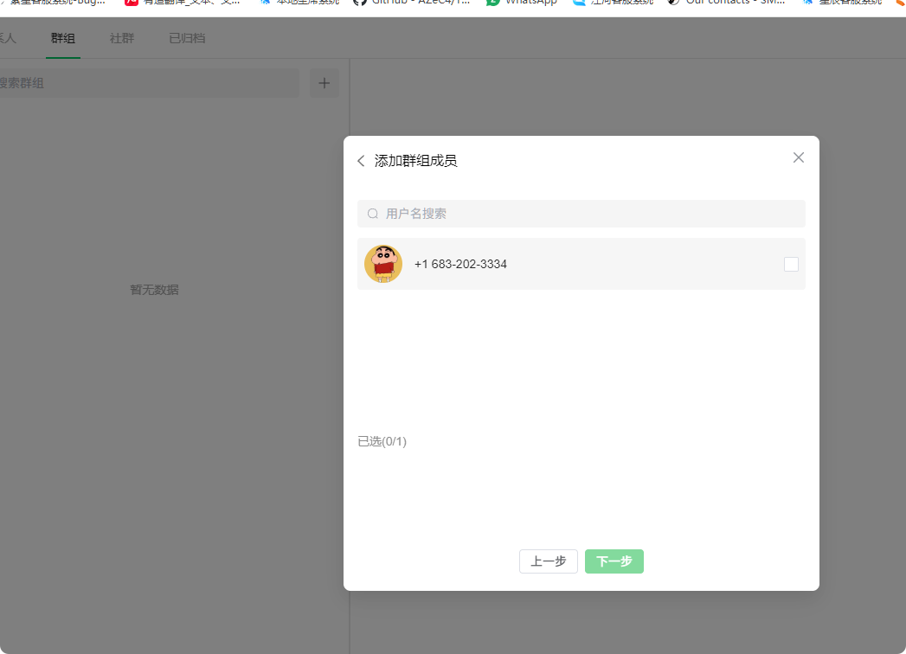

# 什么是盾牌超能力

分类：常见问题
更新时间：2026-06-24T10:50:16+08:00
ID：017fd6fd9859424b3e429587

**本文说明盾牌超能力的含义、获取方式、查看入口，以及使用时需要注意的风险。**

> 注意：盾牌表示该粉丝与星辰协议账号之间已经建立过可信互动，可用于判断是否适合主动发起聊天；但不建议为了使用功能去频繁点击【加好友】。
> 2026 年 6 月官方更新了盾牌机制，新版盾牌加入了“橙色”盾牌，代表官方新添加的不可信隐私，用于区分“绿色”盾牌的官方百分百信任。
> 改版后按照“绿色盾牌大胆发，橙色盾牌必要发就发，限制就停止，封了就复接；没必要不要发橙色盾牌”

## 一、什么是盾牌超能力

盾牌分两种：

1. 绿色盾牌
2. 橙色盾牌

~~盾牌超能力是星辰用于识别可信粉丝的标识。账号拥有盾牌后，可以更清楚地判断哪些粉丝适合主动聊天、建群或邀请进群。~~

【绿色】盾牌超能力是星辰用于识别可信粉丝的标识。账号拥有【绿色】盾牌后，可以更清楚地判断哪些粉丝适合主动聊天、建群或邀请进群。

【绿色】盾牌的核心作用：

~~盾牌的核心作用~~

1. 帮助坐席判断对方是否为可信互动对象。
2. 降低主动发消息时触发风控的概率。
3. 支持星辰协议账号之间共享可信标识。
4. 不需要先加好友，也可以基于已有对话进行后续操作。

【橙色】盾牌超能力是官方新风控导致的产物。

【橙色】盾牌的核心作用：

1. 有限度地可以尝试主动联系对方，【大概率】只会先触发【限制】而不是【封号】。
2. 如果确定对方会因为你主动联系而回复，橙色盾牌等效于绿色盾牌，且会在对方【回复消息】后变绿。

## 二、盾牌如何产生

~~只要粉丝主动发消息，或者回复过你的消息，就会获取盾牌标识。~~

只要粉丝主动给你发消息，或者回复过你的消息，你就会获取粉丝的【绿色】盾牌标识。

~~所有星辰协议的盾牌标识是共享的。例如账号 A 获取了粉丝 1 的盾牌，账号 B 或新注册账号 C 也可以直接向粉丝 1 发起聊天，并降低触发风控的风险。~~

官方新版风控规则，所有的【橙色】盾牌标识是共享的。【绿色】盾牌的标识是不共享的。例如账号 A 获取了粉丝 1 的【绿色】盾牌，账号 B 或新注册账号 C【只会】获得粉丝 1 的【橙色】盾牌，A 和粉丝 1 聊天是低风控风险的。但是 B、C 和粉丝 1 主动聊天，大概率还是有可能触发限制，少概率会封号；需要粉丝 1 回复了，盾牌才会变成【绿色】，风控风险才会降低。

## 三、如何查看是否有盾牌

### 方法一：通过联系人搜索查看

在联系人搜索中查看目标账号，如果该账号有盾牌标识，说明已经属于可信互动对象。

### 方法二：通过群组或社群成员查看

进入群组或社群成员列表，找到对应成员后点击【发信息】。进入聊天会话后，可以查看对方是否有盾牌标识。

## 四、不要为了盾牌去加好友

> 2026/06/04 新增：无论【绿色】盾牌还是【橙色】盾牌，加好友这个风控是官方单独计算的，有不算低的封号概率。

接粉收发消息本身没有风控问题，但【加好友】操作存在封号风险。根据目前统计，不管是主动添加还是被动添加好友，都可能被官方统计并触发风控。

> 建议：不要点击【加好友】按钮。不加好友不影响聊天、建群、邀请进群等功能。

## 五、有盾牌后可以做什么

> 2026/06/04 新增：下面内容限制范围是【绿色盾牌】。

不需要将对方加为好友。只要双方已经产生对话，并且对方带有盾牌，就可以继续进行以下操作：

1. 主动发起聊天。
2. 拉对方组建群组。
3. 邀请对方进入群组。

