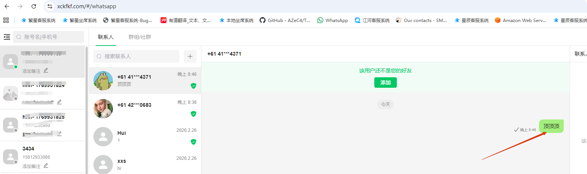
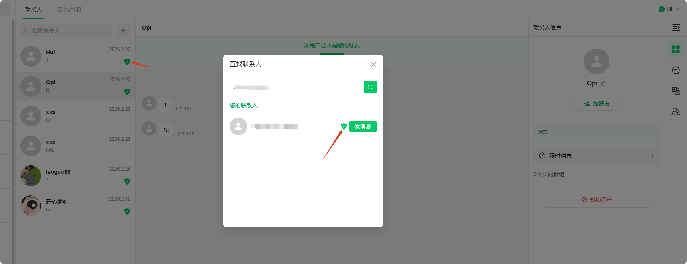
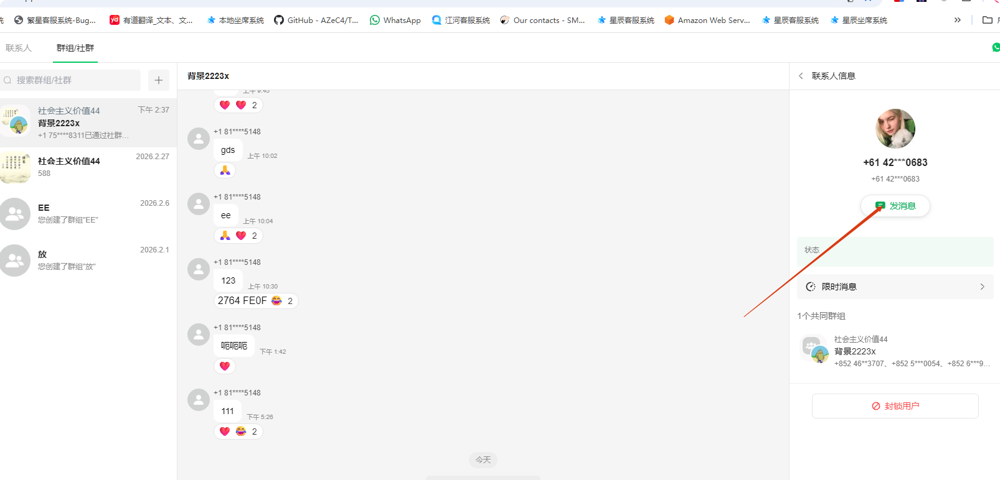
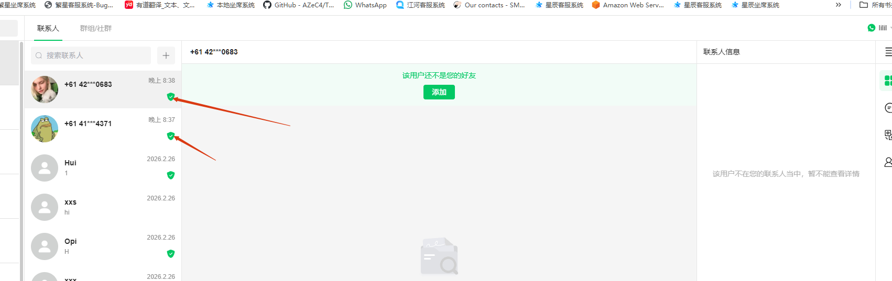
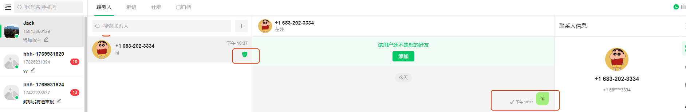
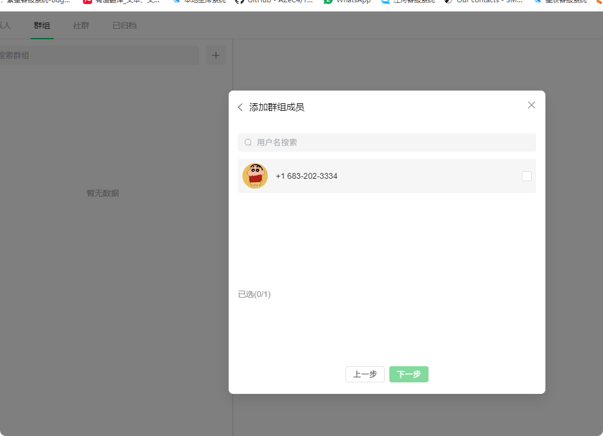

# 什么是盾牌超能力

分类：常见问题
更新时间：2026-09-23T21:35:37+08:00
ID：017fd6fd9859424b3e429587

**本文说明盾牌超能力的含义、获取方式、查看入口，以及使用时需要注意的风险。**

## 一、什么是盾牌超能力

盾牌超能力分为三种：

1. 超级绿盾
2. 绿色盾牌
3. 橙色盾牌

### 超级绿盾

超级绿盾是更高等级的信任标识，<strong class="doc-blue-strong">可以无视【不信任】状态</strong>。拥有超级绿盾后，账号仍需遵守正常使用规则，但不会因为对方账号被标记为【不信任】而失去对应的互动能力。

### 绿色盾牌

【绿色】盾牌超能力是星辰用于识别可信粉丝的标识。账号拥有【绿色】盾牌后，可以更清楚地判断哪些粉丝适合主动聊天、建群或邀请进群。

> <strong class="doc-blue-strong">【2026年9月23日更新】</strong>注意：如果你的号码被官方标记了<strong class="doc-blue-strong">【不信任】</strong>，那么绿盾收发消息也是会有封号的概率（新增风控规则）。

### 橙色盾牌

【橙色】盾牌超能力是官方新风控导致的产物。

【橙色】盾牌的核心作用：

> <strong class="doc-blue-strong">【2026年9月23日更新】</strong>橙色盾牌是用来标记对方能被【不加好友】拉群的标记，仅此而已，没有<strong class="doc-blue-strong">私聊</strong>风控改善功能，强制<strong class="doc-blue-strong">私聊</strong>要有<strong class="doc-blue-strong">封号</strong>预期。

## 二、绿盾如何产生

> **超级绿盾由大数据统计产生，目前没有明确、固定的触发条件。对方主动发起的任何互动，都可能帮助系统判断并产生绿盾。**
>
> 常见互动包括但不限于：<strong class="doc-blue-strong">对方将我添加为联系人</strong>、<strong class="doc-blue-strong">对方向我发送消息</strong>、<strong class="doc-blue-strong">对方在与我的共同群内发言</strong>。

1. 在线（非登出和封号）期间，对方主动发私聊
2. <strong class="doc-blue-strong">【2026年9月23日更新】</strong>满足<strong class="doc-blue-strong">有黄盾</strong>、<strong class="doc-blue-strong">跟对方在共同群</strong>、且<strong class="doc-blue-strong">在线期间收到对方在共同群里发送消息</strong>后，黄盾也会升级为绿盾
> <strong class="doc-blue-strong">【2026年9月23日更新】</strong>绿盾不会因为<strong class="doc-blue-strong">登录多久</strong>、<strong class="doc-blue-strong">加好友多久</strong>而产生，<strong class="doc-blue-strong">对方没主动就永远不会有绿盾</strong>

> <strong class="doc-blue-strong">【2026年9月23日更新】</strong>掉号（被封或者登出）绿盾都有可能会降级为黄盾

## 三、如何查看是否有盾牌

### 方法一：通过联系人搜索查看

在联系人搜索中查看目标账号，如果该账号有盾牌标识，说明已经属于可信互动对象。

### 方法二：通过群组或社群成员查看

进入群组或社群成员列表，找到对应成员后点击【发信息】。进入聊天会话后，可以查看对方是否有盾牌标识。

## 四、不要为了盾牌去加好友

> 2026/06/04 新增：无论【绿色】盾牌还是【橙色】盾牌，加好友这个风控是官方单独计算的，有不算低的封号概率。

接粉收发消息本身没有风控问题，但【加好友】操作存在封号风险。根据目前统计，不管是主动添加还是被动添加好友，都可能被官方统计并触发风控。

> 建议：不要点击【加好友】按钮。不加好友不影响聊天、建群、邀请进群等功能。

## 五、有绿盾后可以做什么

> 2026/06/04 新增：下面内容限制范围是【绿色盾牌】。

不需要将对方加为好友。只要双方已经产生对话，并且对方带有盾牌，就可以继续进行以下操作：

1. 主动发起聊天。
2. 拉对方组建群组。
3. 邀请对方进入群组。

