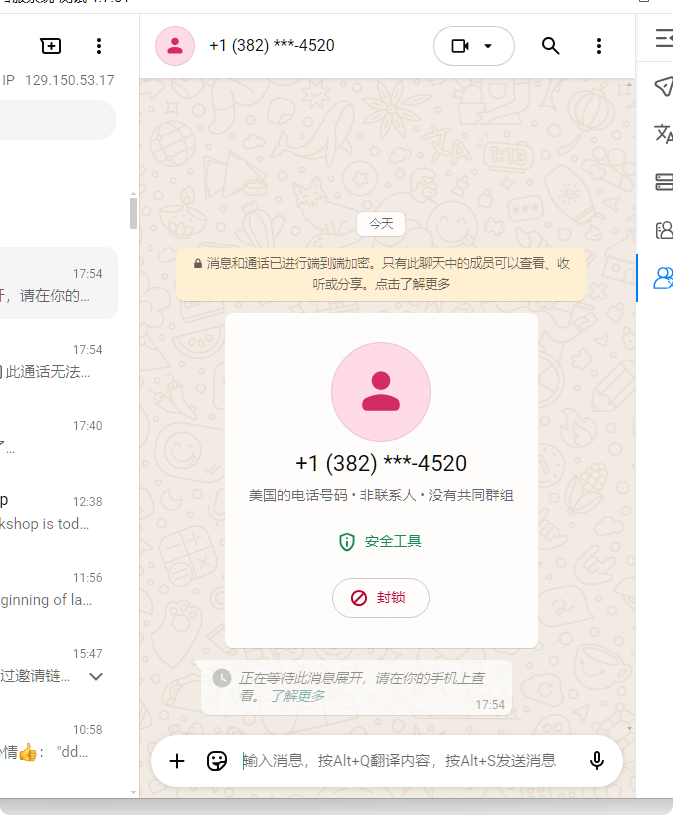
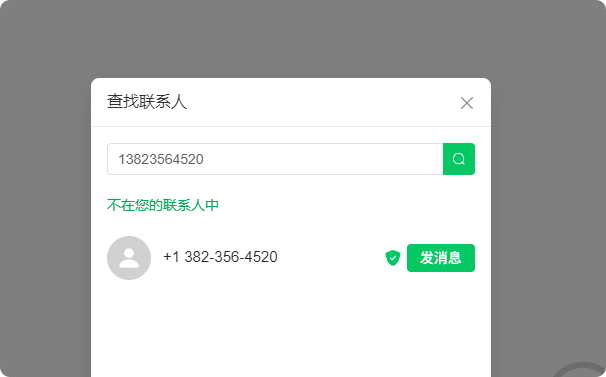
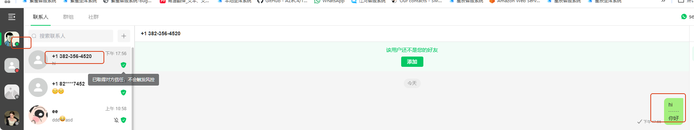

# 我在江河上接粉，在星辰上我可以主动打招呼吗

分类：常见问题
更新时间：2026-05-20T22:50:11+08:00
ID：4f6105e4d0d02911ec7af302

**可以。江河上已经产生互动的粉丝，同步到星辰后会带有盾牌，星辰账号可以主动搜索并打招呼。**

> 提示：江河上的盾牌同步到星辰通常需要一点时间，最迟约 10 分钟。

## 一、可以主动打招呼的前提

需要先满足以下条件：

1. 粉丝已经在江河上给账号发送过消息，或与账号产生过互动。
2. 该粉丝的盾牌状态已经同步到星辰。
3. 在星辰中搜索该粉丝时，可以看到盾牌标识。

满足以上条件后，在星辰上主动发起聊天，通常不会因为主动打招呼触发风控。

## 二、江河上先产生互动

1. 新号先给江河上的账号发送消息。
2. 江河侧产生互动记录后，系统会同步盾牌状态。

## 三、星辰上搜索并打招呼

1. 回到星辰系统。
2. 搜索刚才在江河上产生互动的粉丝。
3. 确认该粉丝已经显示盾牌。
4. 进入会话后，可以主动发送消息。

## 四、注意事项

1. 如果刚在江河上接粉，星辰暂时没有显示盾牌，请等待同步完成后再操作。
2. 不建议在没有盾牌的情况下批量主动打招呼。
3. 主动打招呼不需要先加好友，只要有盾牌并产生会话即可。
