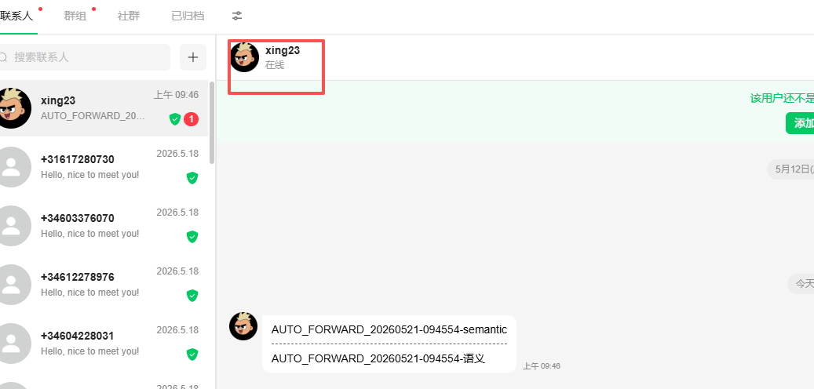
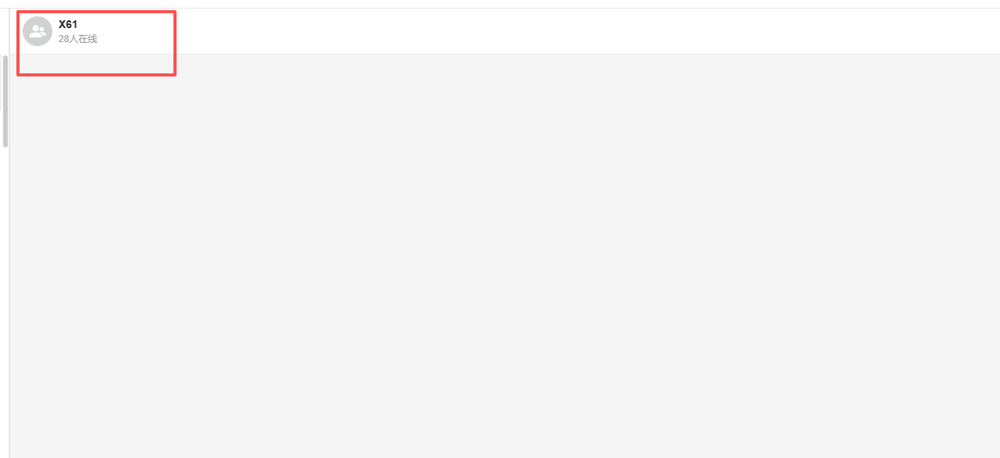
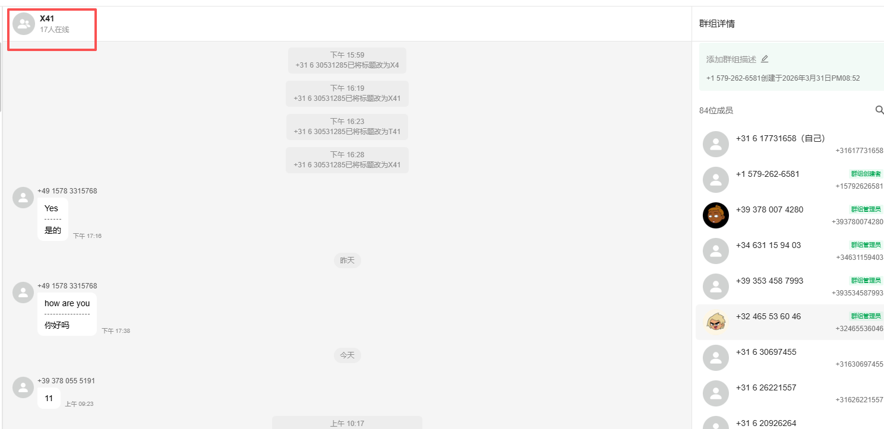
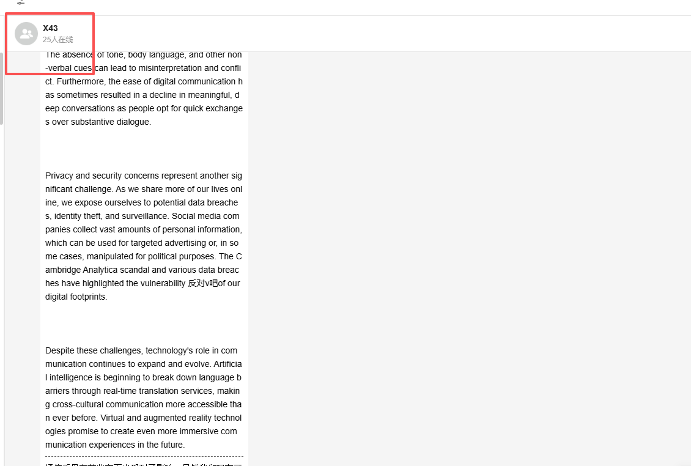
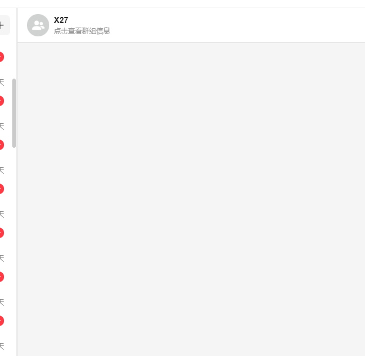
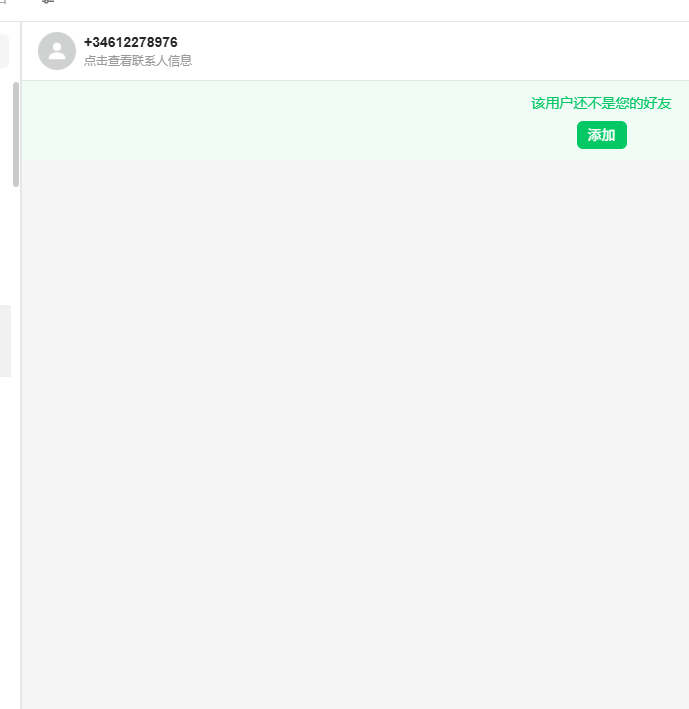
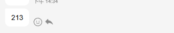
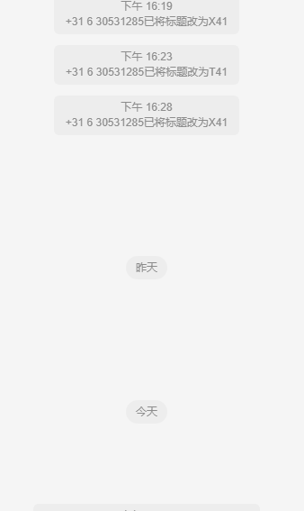
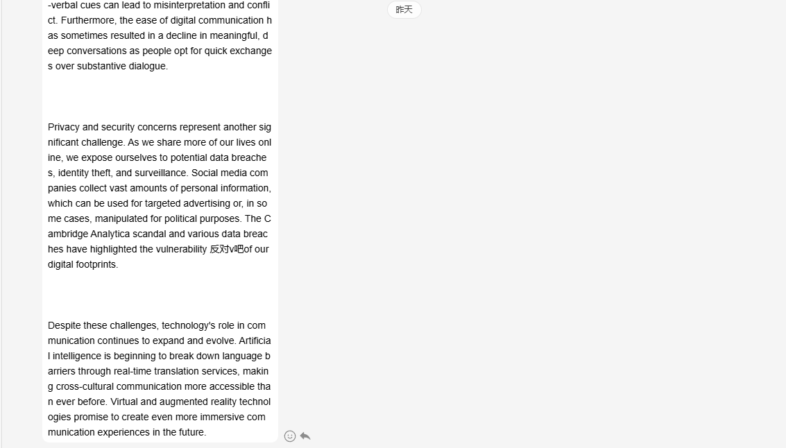

# 所有问题统一格式 /qq 问题描述 + 必要图片（涉及聊天的问题）

分类：常见问题
更新时间：2026-05-22T14:35:00+08:00
ID：a2980b63aff5e5944f3a8147

**所有问题请统一按固定格式提交：问题格式 + 问题描述 + 必要图片。格式完整，才能更快判断问题发生位置和处理方向。**

> 结论：反馈问题时，请先写清楚问题格式，再补充问题描述；涉及聊天、群聊、消息、会话的问题，必须提供能看出【在哪聊天】的完整截图。

## 一、统一提问格式

所有问题统一使用以下格式：

> /qq 问题描述 + 必要图片

提交时请注意：

1. `/qq` 必须放在消息开头。
2. 问题描述要说明你遇到的异常现象。
3. 涉及聊天的问题，必须提供必要图片。
4. 图片要能看出问题发生的位置，尤其要能看出【在哪聊天】。

示例：

> /qq 客户发消息后当前会话没有显示，请帮忙看一下

## 二、什么情况必须带图片

只要问题涉及以下内容，就需要带图片：

1. 私聊消息。
2. 群聊消息。
3. 会话列表。
4. 聊天记录。
5. 消息发送、接收、显示异常。

图片不是为了证明“有问题”，而是为了确认问题发生在哪个账号、哪个会话、哪个群、哪个页面。

## 三、合格图片要求

合格图片必须包含【在哪聊天】。

也就是说，截图里需要能看出问题发生的聊天对象、群聊、会话位置或相关页面，不能只截一小块提示或一小段消息。

以下是符合要求的图片示例：

## 四、不合格图片示例

以下图片不符合要求，常见问题是截图太小，或者看不出问题发生地：

这类截图会影响查证问题的效率，因为处理人员无法确认问题发生在哪个聊天、哪个群或哪个页面。

## 五、提交前自查

提交前请确认：

1. 开头已经写 `/qq`。
2. 问题描述能看懂。
3. 涉及聊天的问题已经附图。
4. 图片里能看出【在哪聊天】。
5. 图片不是只截局部小图，也不是只截报错提示。

> 提示：截图越完整，定位越快；截图太小或不含问题发生地，只会增加来回确认时间。
