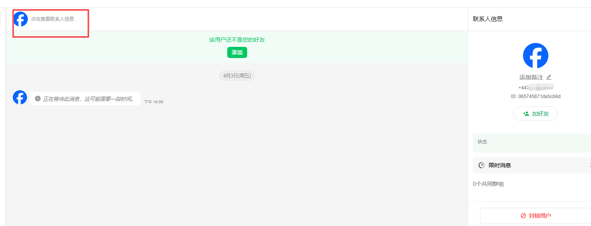
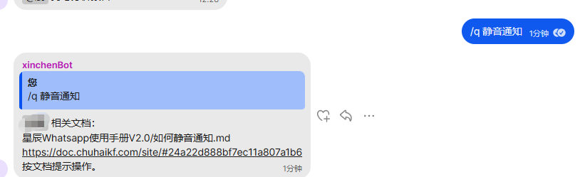
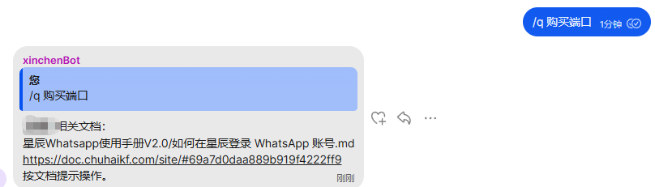
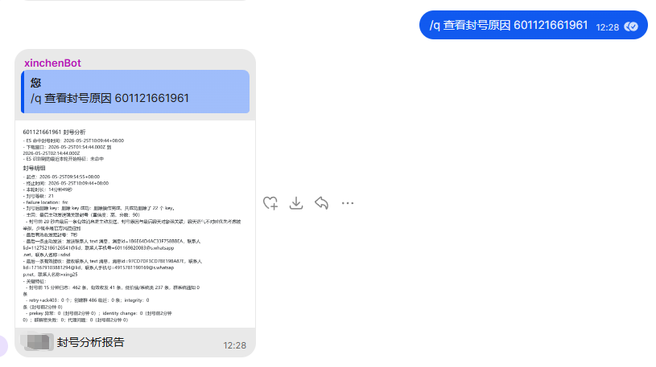
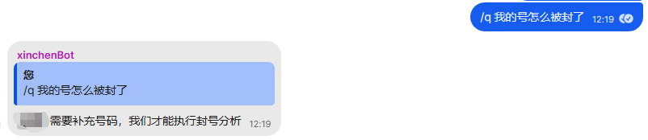

# 提问模板和星辰助手上线

分类：常见问题
更新时间：2026-05-26T00:00:00+08:00
ID：a2980b63aff5e5944f3a8147

星辰助手已上线，提问统一使用 /q。

## 一、聊天相关问题

提问格式：

> /q 号码 图片 问题描述
> 如 /q 34603989581 图片 接收消息不能解密

> 注意：聊天相关问题大部分需要人工查证，请一次性提交完整信息。
> 没有号码星辰助手会直接拒绝记录，，并提醒你补充号码再发一次。
> 截图看不出问题发生在哪个联系人或哪个群星辰助手会直接拒绝记录，并提醒你补充截图再发一次。
> 聊天问题大部分需要多方查证定位问题，不在人工客服上班时间内的问题提交，会在上班后集中处理，后面会有更多的聊天问题加入自助处理，谢谢理解！

## 二、涉及号码但不是聊天的问题

提问格式：

> /q 号码 问题描述

例如号码状态、登录、封号、在线状态等问题，可以按这个格式提交。

## 三、不涉及具体号码的问题

提问格式：

> /q 问题描述

例如：

> /q 怎么打开静音通知

> /q 购买端口

## 四、人工客服时间

> 人工客服时间：北京时间每周日到周五，早上 9 点到晚上 9 点。

需要人工查证的问题，会在记录后等待人工客服上班处理。

> 注意：聊天问题一定要留下符合格式的信息。没有号码、截图不完整，或者看不出问题发生在哪个联系人或哪个群，问题会被忽略记录，需要重新按完整格式提交。

## 五、助手额外功能

### 1. 尝试自动修复消息提醒异常

如果出现接收消息没有红点、点击聊天后才看到具体内容，或者账号在线但发消息提示账号离线，可以让助手尝试自动修复。

提问方式：

> /q 号码 不能接收消息
> /q 没有消息提醒 号码
> /q 号码 账号在线，发消息提示账号离线

> 注意：这类问题必须提交号码。缺少号码时，助手会回复要求补充号码。

### 2. 请求助手分析封号可能原因

如果需要分析封号可能原因，可以按以下方式提问：

> /q 号码 怎么封号了
> /q 号码 分析封号原因
> /q 号码 为什么封禁

助手会根据号码情况分析原因，并发送分析报告。

> 注意：这类问题必须提交号码。缺少号码时，助手会回复要求补充号码。

> 注意：目前所有号码都缺少养号环节。封号原因里如果没有更明确的问题，分析结论通常只会是不养号被封。
> 注意：不要滥用封号原因分析功能。星辰会视情况禁用该功能；是否属于滥用，会参考上面的养号结论，不应该连续、多个提交封号查询请求。
