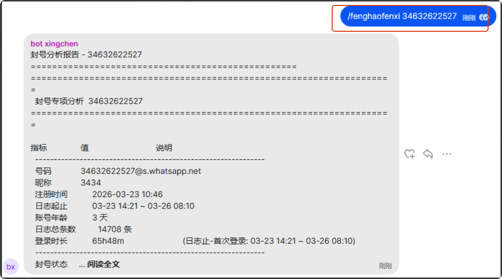
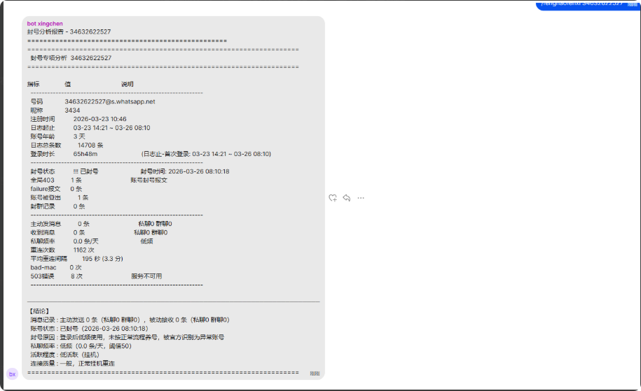

# 星辰封号自助查询机器人上线及说明

分类：常见问题
更新时间：2026-03-26T03:57:40.232Z
ID：6380957ca4286f742b8aa074

1、封号原因95%以上属于登录后不正常养号，如果自己确认没有养号或者没有参考星辰建议登录后的账号维护工作，那不用查原因都是因为不正常使用导致登录风控触发。

2、低频挂机（我有自己跟自己的号聊天，几个群偶尔聊聊等都属于低频），正常的使用频率是接粉且炒群

需要查询某个号的封号分析情况，如：34632622527
在ant所在的群输入 "/fenghaofenxi 34632622527"
发送后机器人分析完回自动回复到群里

## 注意：私聊机器人不会有任何回复

自己的号有没养号，是否正常使用自己清楚，此功能禁止滥用，只是用于二次确认问题或者查询正常使用还被封号分析原因  需要批量导出分析结果群内联系 @朋 （没有养号或者正常使用，不提供服务）

正常使用是指养号后正常业务工作，不是登录后随意操作或者登录后低频使用挂机
