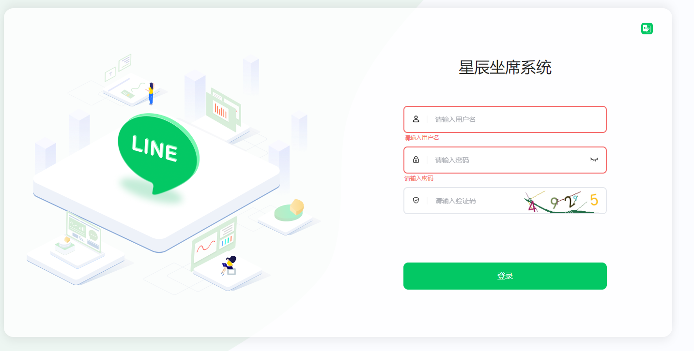
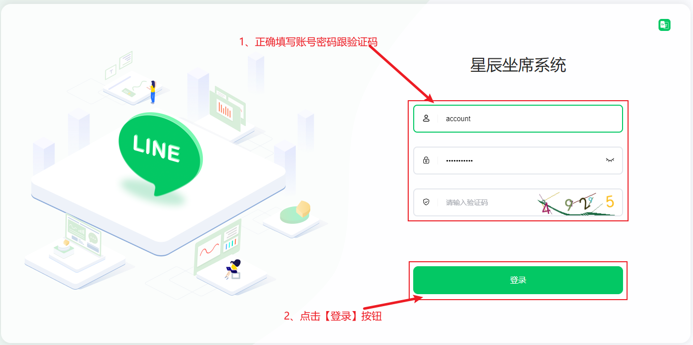
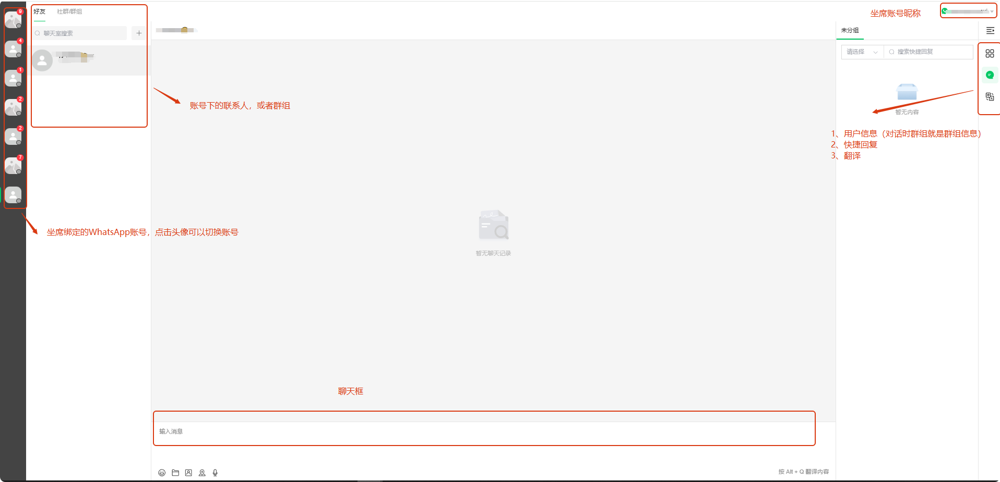

# 如何使用坐席进行聊天

分类：星辰Whatsapp使用手册V2.0
更新时间：2026-05-20T18:55:00+08:00

**本文说明坐席如何登录坐席系统，并使用已绑定的 WhatsApp 账号进行聊天。坐席系统的聊天操作方式与 WhatsApp 网页端基本一致。**

## 一、打开坐席系统

1. 打开坐席系统登录页面。
2. 访问链接：[星辰坐席系统](https://www.xckfkf.com/#/login)

   

## 二、登录坐席账号

1. 输入正确的坐席账号。
2. 输入密码和验证码。
3. 点击【确定】，提交登录。

   

## 三、进入聊天页面

1. 登录成功后，系统会进入坐席系统主页面。
2. 在坐席系统中选择需要操作的 WhatsApp 账号或会话。
3. 进入会话后即可进行私聊或群聊操作。

   

> 提示：坐席系统的聊天体验与 WhatsApp 网页端基本一致。如果看不到对应账号，请先确认该 WhatsApp 账号是否已经绑定到当前坐席。
