# 如何使用对话自定义分组

分类：星辰Whatsapp使用手册V2.0
更新时间：2026-05-20T20:34:07+08:00
ID：7466efc325536dd41f9258fa

**本文说明如何创建对话自定义分组，并对分组中的联系人、群组或社群会话进行添加、移除、重命名和删除操作。**

## 一、创建自定义分组

1. 在会话列表中点击【管理分组】。

   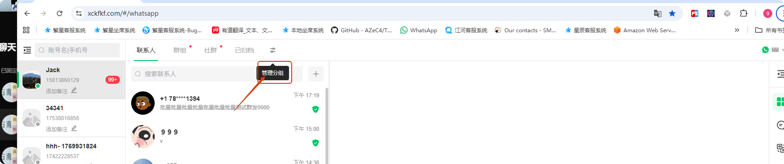

2. 点击【+】按钮，新建分组。

   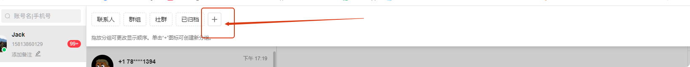

3. 在创建界面填写分组名称，勾选需要加入分组的会话，然后点击【创建】。

   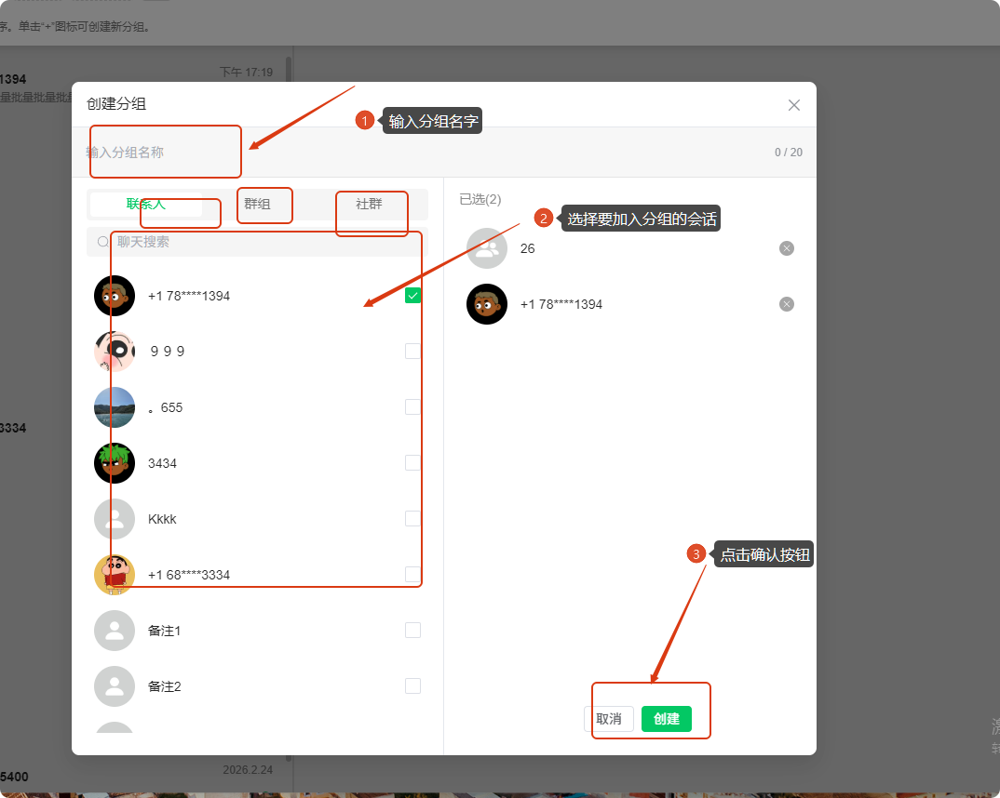

4. 页面提示创建成功后，即完成自定义分组创建。

   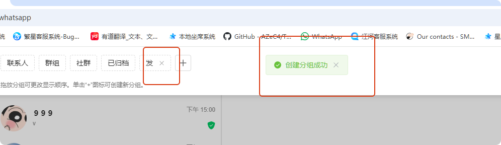

## 二、修改分组名称

1. 找到需要修改的分组，点击【更改分组名称】按钮。

   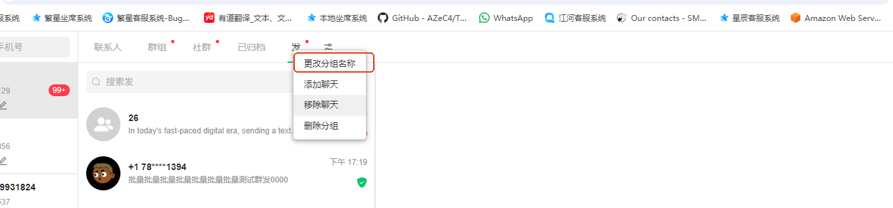

2. 在弹窗中填写新的分组名称。
3. 点击【确认】，保存新的分组名称。

   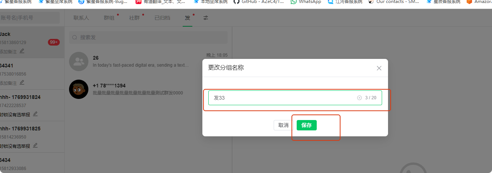

## 三、添加聊天到分组

1. 进入目标分组，点击【添加聊天】按钮。

   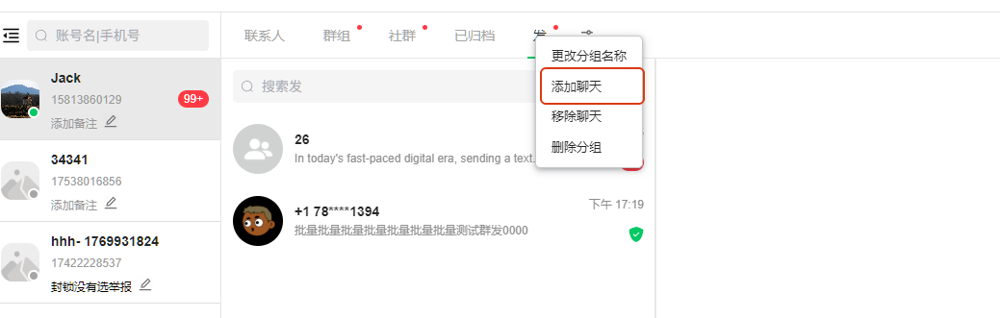

2. 勾选需要加入该分组的聊天会话。
3. 点击【添加】。

   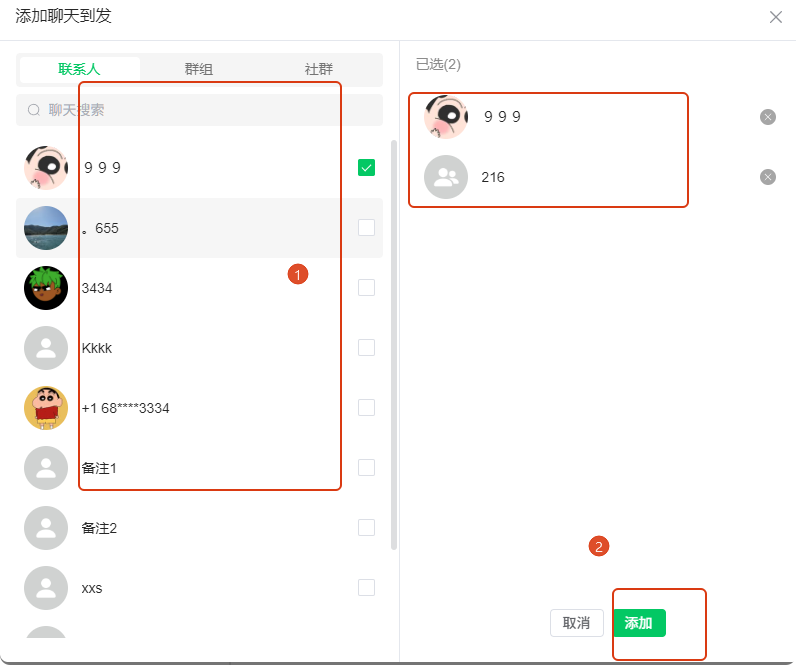

4. 添加成功后，可以在该分组下看到刚才勾选的聊天会话。

   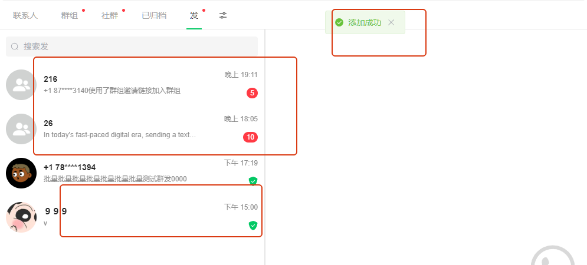

## 四、从分组中移除聊天

1. 进入目标分组，点击【移除聊天】按钮。

   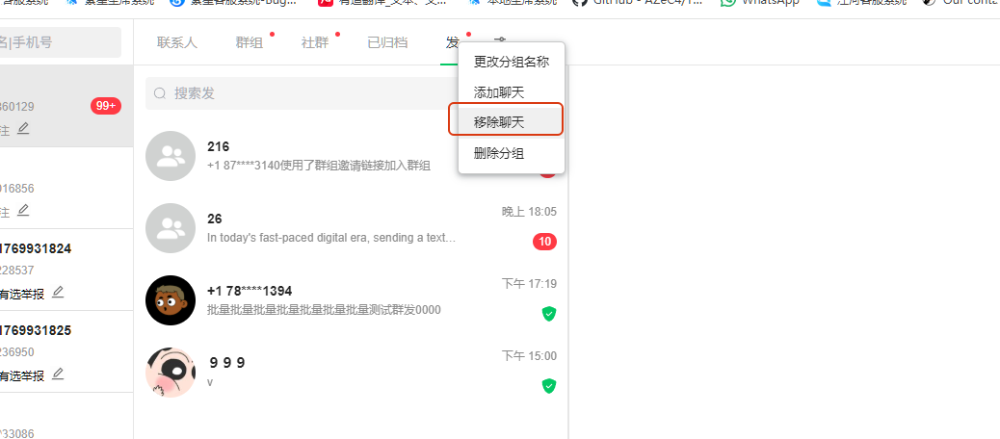

2. 在弹窗中勾选需要移除的聊天。
3. 点击【移除】。

   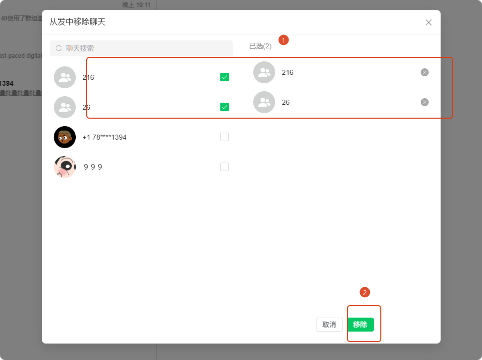

4. 移除成功后，会话会回到默认分类：联系人回到联系人列表，群组聊天回到群组，社群聊天回到社群。

   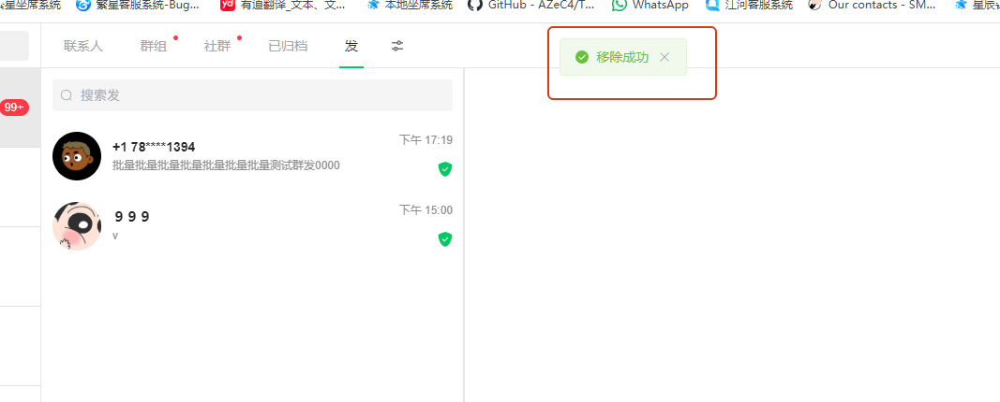

## 五、删除自定义分组

1. 找到需要删除的分组，点击【删除分组】按钮。

   

2. 系统弹出确认删除界面后，确认提示内容。
3. 点击【删除】完成删除。

   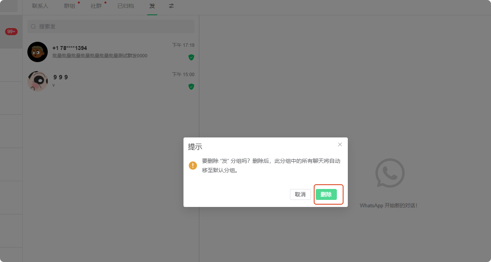

> 注意：删除分组后，该分组中的所有聊天会自动移至默认分组，不会删除聊天本身。

## 六、转移会话到其他分组

如果需要把会话转移到新的分组，可以进入目标新分组，使用【添加聊天】选择要转移的会话。添加完成后，该会话就会出现在新的分组中。
