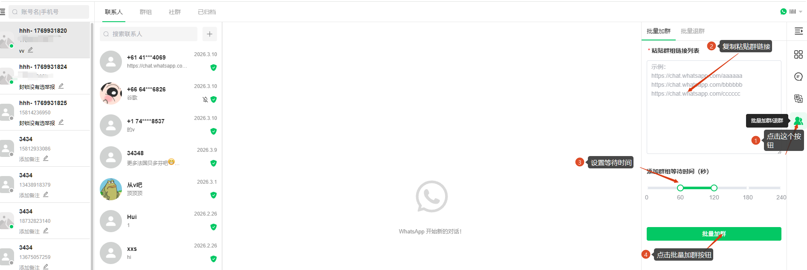
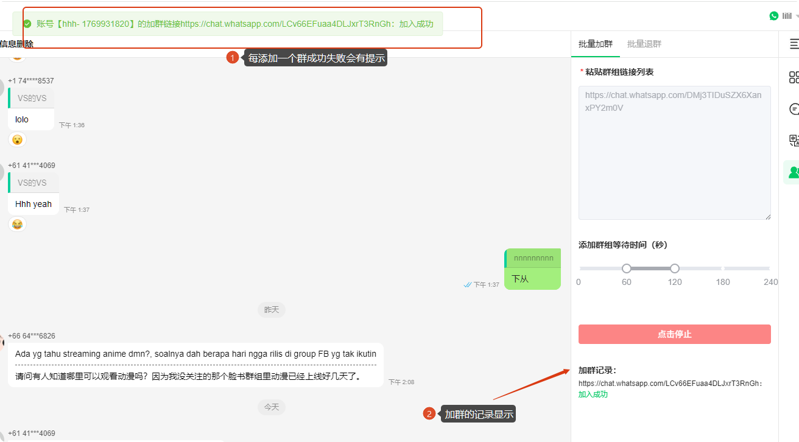

# 如何使用批量加群

分类：星辰Whatsapp使用手册V2.0
更新时间：2026-05-20T20:40:44+08:00
ID：749e3e05e9e68b4ea6aca3a0

**本文说明如何在坐席系统中使用批量加群功能。该功能用于一次性添加多个群链接，并按设置的间隔逐个执行加群操作。**

> 注意：新号通过链接批量加群有可能封号。
> 注意：老号通过链接批量加新群有可能封群。
> 注意：大量的加群动作需要养号，接力加群必封群或者封号（先少部分人拉一起创群，然后其他号通过链接批量进群，这个操作叫接力。接力是已知的违禁动作）。

## 一、打开批量加群功能

1. 进入坐席系统。
2. 点击坐席右侧底部的【批量加群 / 退群】按钮。

## 二、填写群链接并开始加群

1. 粘贴需要添加的群链接。
2. 设置等待时间。
3. 点击【批量加群】，系统开始按顺序执行加群。

   

## 三、查看加群结果

1. 批量加群开始后，系统会逐个处理群链接。
2. 每添加一个群，都会显示成功或失败提示。
3. 页面会同步展示加群记录，方便核对执行结果。

   

## 四、操作限制

> 注意：批量加群过程中不要刷新浏览器。刷新会自动停止批量加群。同时不要开启批量退群，因为加群和退群只能执行一项，不能同时进行。
