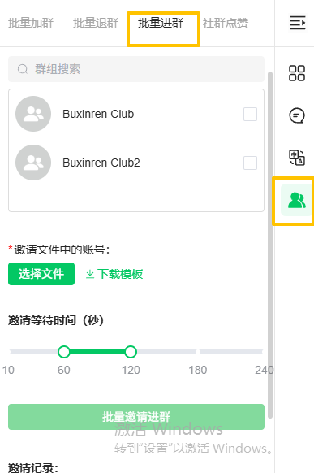
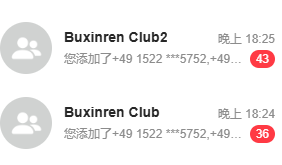

# 如何使用批量进群

分类：星辰Whatsapp使用手册V2.0
更新时间：2026-10-08T00:00:00+08:00
ID：manual-batch-invite-groups

**使用「批量进群」，可以由已在群内的账号，将文件中的账号按设定的时间间隔批量邀请进群。**

## 一、操作前：准备好群和邀请账号

### 先确认目标群为低风控群

请先确保需要邀请成员加入的群是低风控群。如果无法确认，可以准备 **20 个全新账号**，委托星辰协助建群，准备时间约为 **4–6 天**。

> 建议提前安排建群，待群准备好后，再进行批量邀请。

### 邀请账号必须已在全部目标群内

执行邀请操作的账号，需要先加入所有目标群。例如：需要向 **50 个群**邀请成员，这个邀请账号就必须已经在这 **50 个群**内。

## 二、打开群工具，设置批量邀请

1. 使用准备好的邀请账号，打开聊天界面右侧的 **群工具**。
2. 选择顶部的 **「批量进群」**。
3. 在群列表中勾选本次需要邀请成员进入的目标群。
4. 点击 **「下载模板」**，按模板填写需要邀请的账号，再点击 **「选择文件」**上传。
5. 设置 **「邀请等待时间（秒）」**。
6. 确认目标群、邀请文件和等待时间后，点击 **「批量邀请进群」**。

## 三、按时间间隔执行，查看邀请结果

开始后，系统会按照设置的时间间隔，批量邀请文件中的账号加入所选群。

可在工具面板的 **「邀请记录」** 中查看执行情况，并结合群聊中的邀请提示核对结果。

## 注意事项与常见问题

### 拉人进群时，执行邀请的账号被封了，怎么办？

按星辰的使用经验，在低风控群中进行邀请，出现此类封号的概率极低，不要在群风控情况不明的时候滥用。

**如果无法确认群的风控情况，请按第一步的指引，准备 20 个全新账号，委托星辰协助建群，预计需要 4–6 天。**
