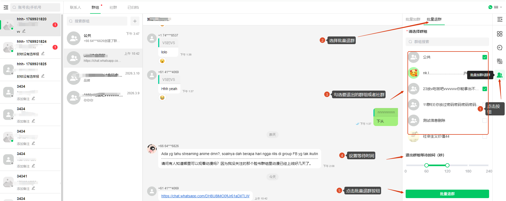
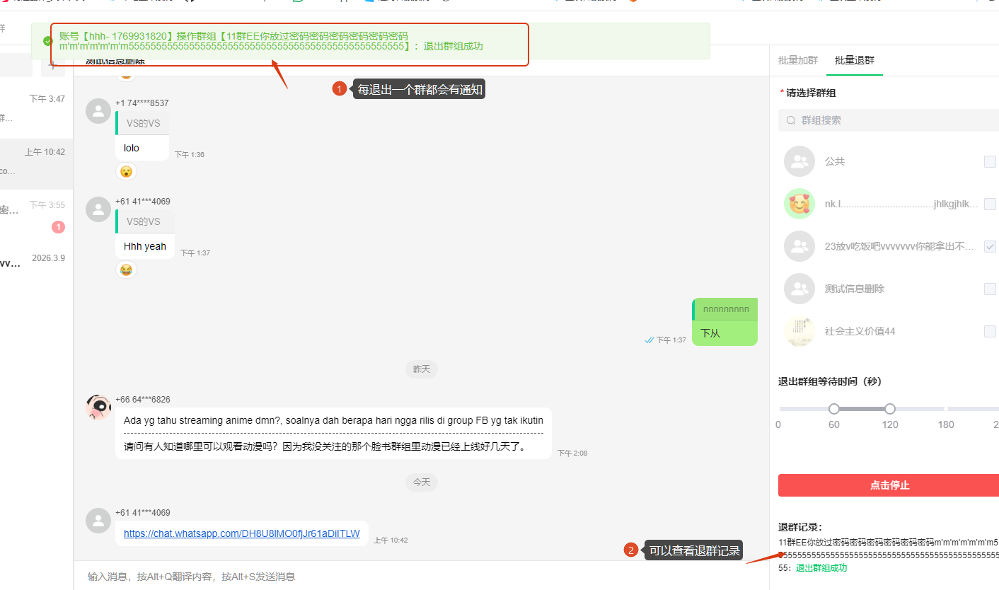

# 如何使用批量退群

分类：星辰Whatsapp使用手册V2.0
更新时间：2026-05-20T20:40:44+08:00
ID：58b9b6849105343563639e9c

**本文说明如何在坐席系统中使用批量退群功能。该功能用于批量选择群聊，并按设置的间隔逐个执行退群操作。**

> 注意：一般情况下不会触发风控。如果不确定适合的操作频率，请不要修改默认间隔配置。

## 一、打开批量退群功能

1. 进入坐席系统。
2. 点击坐席右侧底部的【批量加群 / 退群】按钮。
3. 切换到【批量退群】页面。

## 二、选择群聊并开始退群

1. 勾选需要退出的群聊。
2. 设置等待时间。
3. 点击【批量退群】，系统开始按顺序执行退群。

   

## 三、查看退群结果

1. 批量退群开始后，系统会逐个处理已勾选的群聊。
2. 每退出一个群，都会显示成功或失败提示。
3. 页面会同步展示退群记录。
4. 如需中断操作，可以点击【停止】。

   

## 四、操作限制

> 注意：批量退群过程中不要刷新浏览器。刷新会自动停止批量退群。同时不要开启批量加群，因为加群和退群只能执行一项，不能同时进行。
