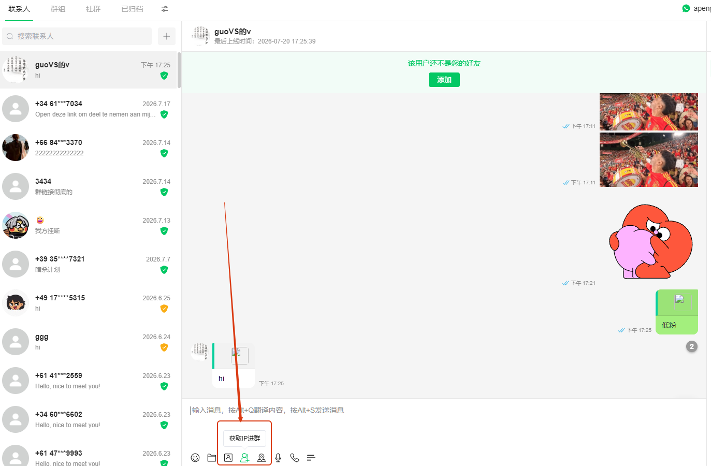
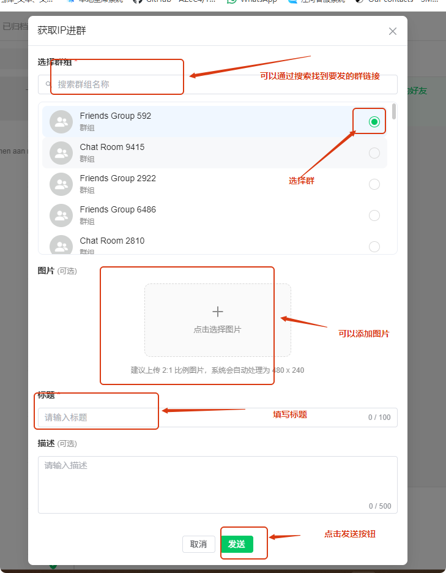
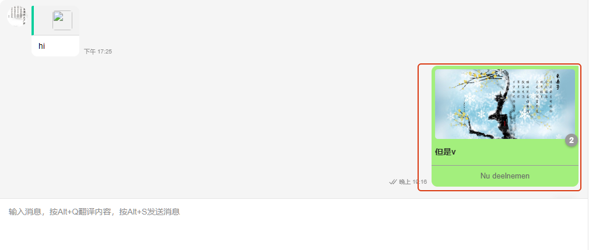
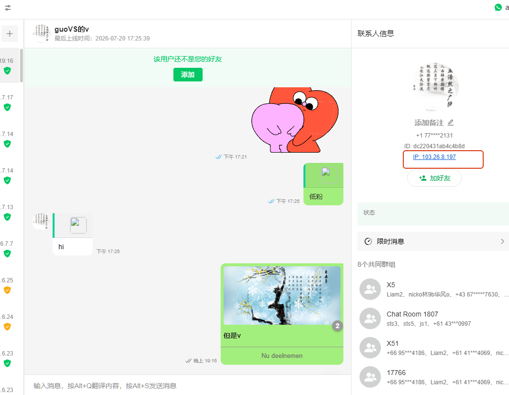
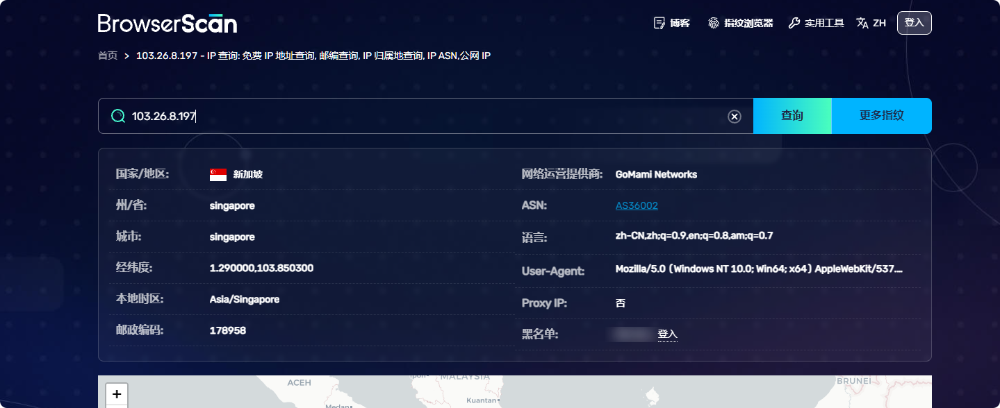

# 如何使用获取IP进群

分类：星辰Whatsapp使用手册V2.0
更新时间：2026-07-20T19:21:21+08:00
ID：6a5e04a3ab7e481ca52c30d4

**本文介绍如何通过发送群邀请链接获取对方 IP 信息，包括发送邀请和查看 IP 两个步骤。**

> 提示：对方通过邀请链接加入群组后，系统将自动获取其 IP 信息，可在好友详情中查看。

## 一、如何发送群邀请链接

1. 在聊天界面中，找到输入框下方的**第四个按钮**（群邀请入口）。

   

2. 点击按钮后进入拉群发送界面，填写以下信息：

   - **选择群组**（必填）：选择要邀请对方加入的群组
   - **选择图片**：选择一张展示图片
   - **输入标题**（必填）：填写邀请标题
   - **输入描述**：添加邀请描述信息

   填写完成后，点击**发送**按钮。

   

3. 系统将发送一条群邀请消息给对方，对方点击即可加入群组。

   

## 二、如何查看获取的 IP

1. 对方通过邀请链接加入群组后，进入该好友的**详情页面**，即可查看 IP 信息。

   

2. 点击详情页面中的 **"IP"** 标签，将跳转到 IP 信息详情界面，查看完整的 IP 相关数据。

   

> 建议：获取到 IP 信息后，可结合其他功能进一步分析好友的网络环境，辅助运营决策。
