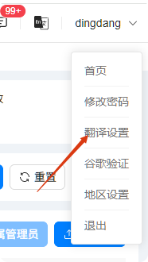
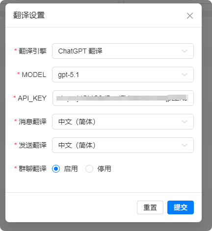
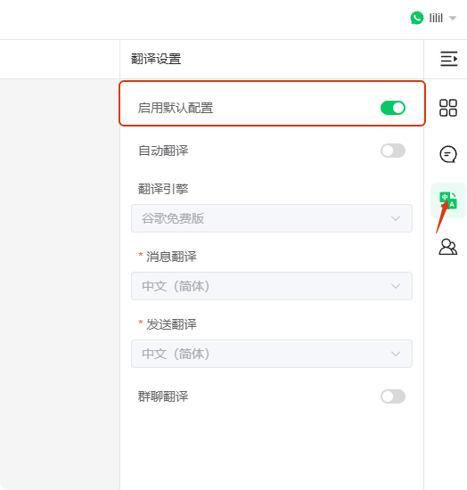

# 如何全局修改翻译设置

分类：星辰Whatsapp使用手册V2.0
更新时间：2026-05-20T20:20:27+08:00
ID：130fdeea74a9912da4275485

**本文说明如何在后台配置全局翻译设置，并让坐席端使用这套默认配置。适合需要统一翻译引擎、API KEY、消息翻译和群聊翻译规则的场景。**

> 注意：建议使用默认的谷歌免费版就好。

## 一、打开全局翻译设置

1. 点击账号名称右侧的展开按钮。
2. 点击【翻译设置】，打开翻译设置界面。

   

## 二、修改翻译配置

1. 根据业务需要选择翻译引擎。
2. 填写或修改 `API KEY`。
3. 配置消息翻译、发送翻译和群聊翻译。
4. 确认设置无误后，点击【提交】保存配置。

   

> 注意：修改全局配置前，请确认 API KEY 可用。配置错误可能导致翻译不可用或翻译失败。

## 三、坐席端启用默认配置

1. 进入坐席系统界面。
2. 打开坐席端的翻译设置。
3. 勾选【启用默认配置】。
4. 开启后，坐席端会使用后台设置的全局翻译配置。

   
