# 如何在星辰登录 WhatsApp 账号

分类：星辰Whatsapp使用手册V2.0
更新时间：2026-05-20T19:56:33+08:00

**登录前请先确认预计登录的账号数量，并购买对应数量的端口和IP,星辰的端口相当于一台手机，一个号登录需要一个端口和一个IP，即一号一端口一IP**
## 一、购买 端口
1. 点击左上方【购买套餐】
2. 选择【whatsapp】产品，修改需要购买的端口个数，默认选择时间是一个月。

   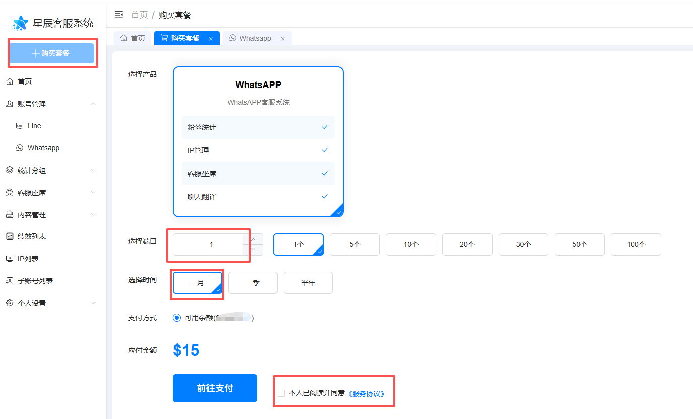

3. 勾选同意《服务协议》，点击【前往支付】，进入【确认订单】弹窗。
4. 确认订单信息无误后，必须点击【确认支付】。

   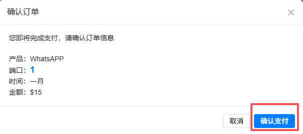

5. 购买成功后，点击导航【账号管理】->【whatsapp】会看到购买的端口数目增加在【端口总数】和【可用端口数】。

   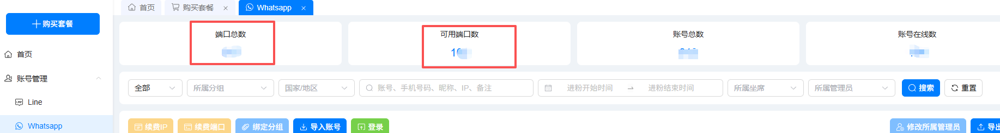

## 二、购买 IP

登录 WhatsApp 账号前，建议先完成 IP 购买，避免后续绑定或登录时因 IP 未准备好影响操作。

1. 在左侧菜单点击【IP 列表】，进入 IP 管理页面。
2. 在 IP 列表中查看当前账号已拥有的 IP 情况。
3. 点击右侧【购买 IP】按钮，打开【购买 IP】弹窗。

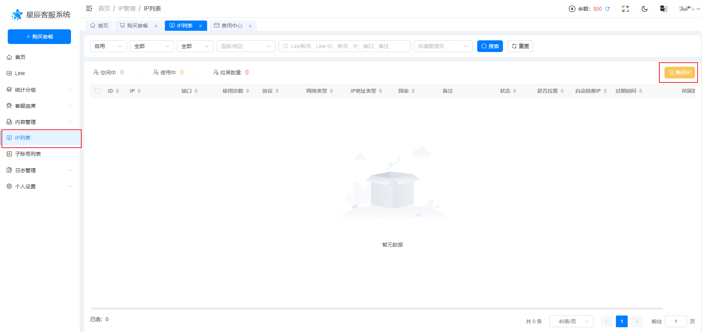

### 填写购买信息

1. 选择需要购买的 IP 国家或地区。
2. 选择购买数量。目前 IP 仅支持单次购买 30 天。
3. 勾选同意《服务协议》，点击【前往支付】，进入【确认订单】弹窗。

   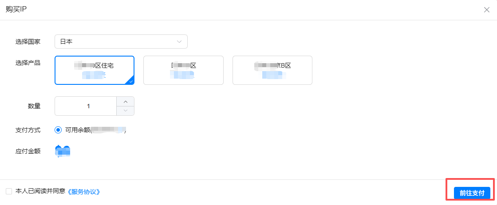

4. 确认订单信息无误后，必须点击【确认支付】。

   > 注意：必须看清楚国家和数量是否对，购买错误无法退款。

   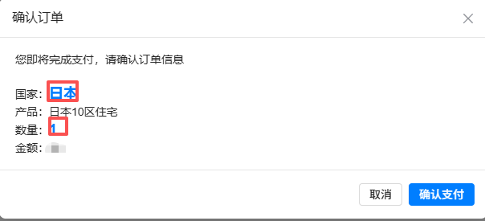

5. 页面提示【支付成功】后，表示端口购买成功。

> 注意：IP 购买最晚 30 分钟发货，平均发货时间为 10 分钟。如果超过 30 分钟仍未到账，请联系客服处理。为保证账号能正常登录和使用，建议提前购买 IP。

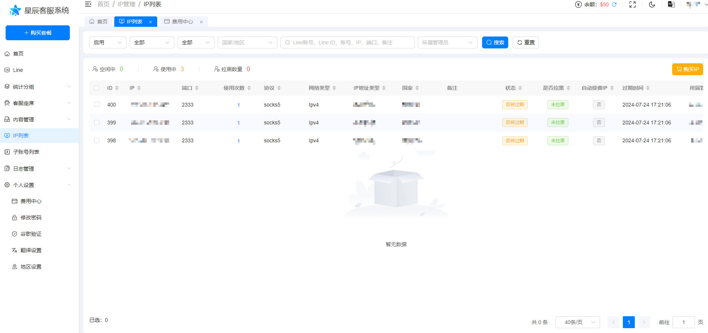

## 三、将 WhatsApp 账号登录到管理员账号下

> 建议先完成 IP 购买，再进行账号登录或绑定操作。

1. 点击导航【账号管理】->【whatsapp】-> 【登录】按钮，打开登录弹窗。

   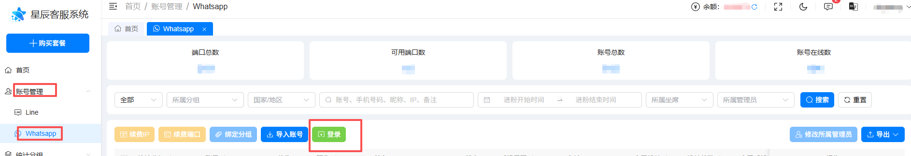

2. 选择已购买的ip ->填写托号预设昵称 -> 选择 国家 -> 填入 国家区号的号码，如：86135****3252，点击【确认】。
   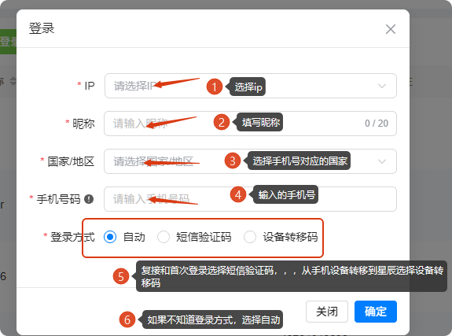
3. 如果号码没有被注册，请求发送成功会弹出【验证码】输入窗口，输入手机收到的短信验证码，再次点击【确认】，如果页面显示【导入成功】代表号码已经注册并登录成功。
   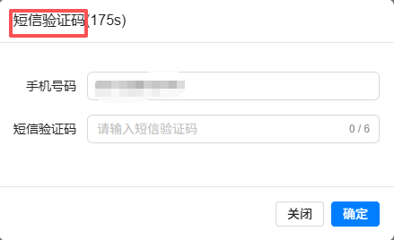
   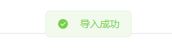
4. 如果号码已经被注册，请求发送成功会弹出【主设备验证码】输入窗口，输入手机whatsapp上弹出的转移码，再次点击【确认】，如果页面显示【导入成功】代表号码已经转移并登录成功。
   > 注意：如果明知号码已经被注册，但是登录【自动】发的是短信，可以在第2点，选择【设备转移码】强制发出转移码
   > 注意：转移码不能正常识别的号码，大多数是风控中的号码（风控不等于封号，表现是不让正常登录），故强制模式有一定失败的概率，遇到登录失败24小时后再试
   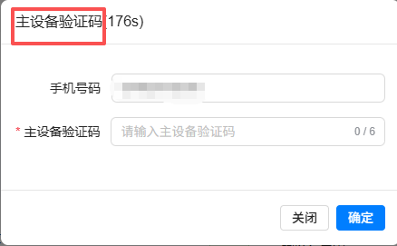
   
5. 登录成功后，【WhatsApp 账号】会加入到【星辰客服系统】中，后续可绑定坐席并进行业务操作。

## 四、下一步：绑定坐席

账号登录到星辰客服系统后，如需由坐席继续操作，请参考：[如何将 WhatsApp 账号与坐席进行绑定](%E5%A6%82%E4%BD%95%E5%B0%86WhatsApp%E8%B4%A6%E5%8F%B7%E4%B8%8E%E5%9D%90%E5%B8%AD%E8%BF%9B%E8%A1%8C%E7%BB%91%E5%AE%9A.md)
