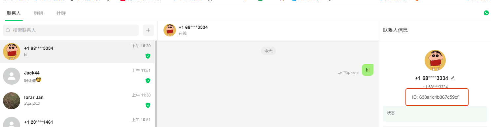
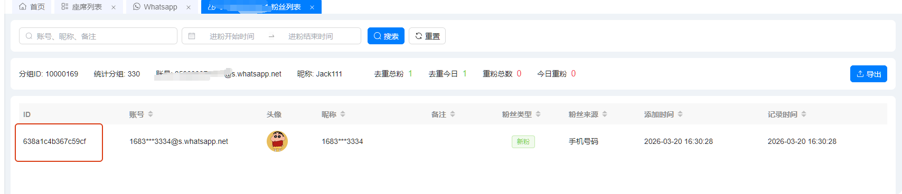

# 如何对应坐席好友和统计工单的粉丝

分类：星辰Whatsapp使用手册V2.0
更新时间：2026-05-20T20:29:57+08:00
ID：8983db65132cba9a1dc96751

**本文说明如何通过好友 ID 对应坐席系统中的好友和后台统计工单中的粉丝，方便核对同一个粉丝在不同页面中的数据。**

## 一、在坐席系统查看好友 ID

1. 登录坐席系统。
2. 打开需要核对的好友详情。
3. 在好友详情中查看好友 ID。该 ID 是好友的唯一标识。

   

## 二、在后台粉丝列表查看 ID

1. 进入后台的粉丝列表。
2. 找到需要核对的粉丝记录。
3. 查看粉丝列表中的 ID。

   

## 三、对应关系说明

坐席系统好友详情中的 ID，与后台粉丝列表中的 ID 是对应的。两个页面中 ID 一致，即表示它们是同一个粉丝。

> 提示：核对粉丝归属或统计数据时，优先使用 ID 判断，不要只依赖昵称或头像，因为昵称和头像可能重复或发生变化。
