# 如何将 WhatsApp 账号与坐席进行绑定

分类：星辰Whatsapp使用手册V2.0
更新时间：2026-05-20T18:45:00+08:00

**本文说明如何新建坐席账号，并将 WhatsApp 账号绑定到对应坐席。绑定完成后，坐席登录坐席系统即可操作该 WhatsApp 账号。**

> 注意：如果需要更改已绑定的坐席（在坐席中去掉某个号码的绑定），请联系【F-对接群】里面反馈。

## 一、新建坐席账号

1. 展开左侧菜单【客服坐席】，点击【坐席列表】。

   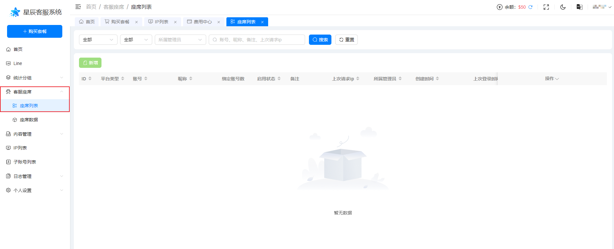

2. 进入【坐席列表】后，点击【新增】，打开【新增坐席账号】弹窗。

   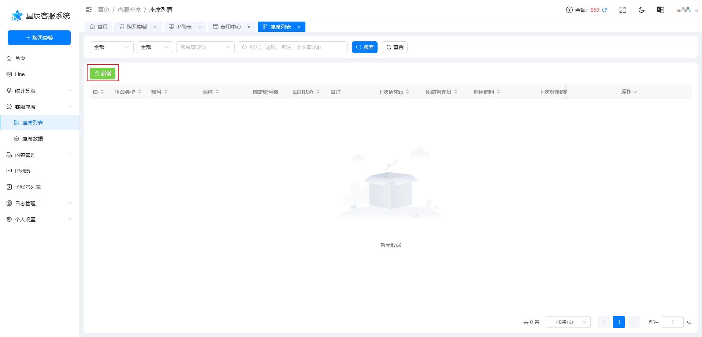
   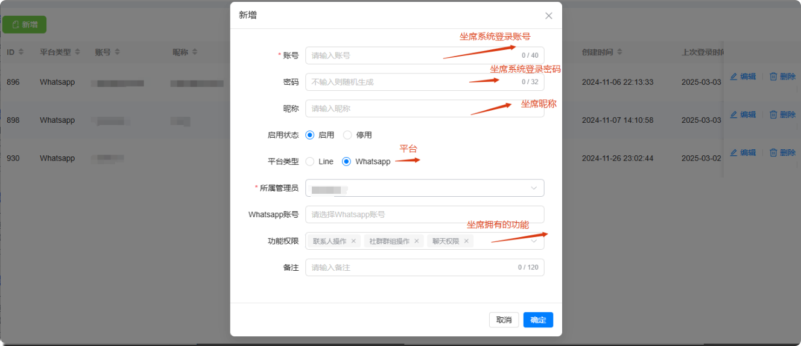

3. 按要求填写坐席账号信息，确认无误后点击【确定】。

   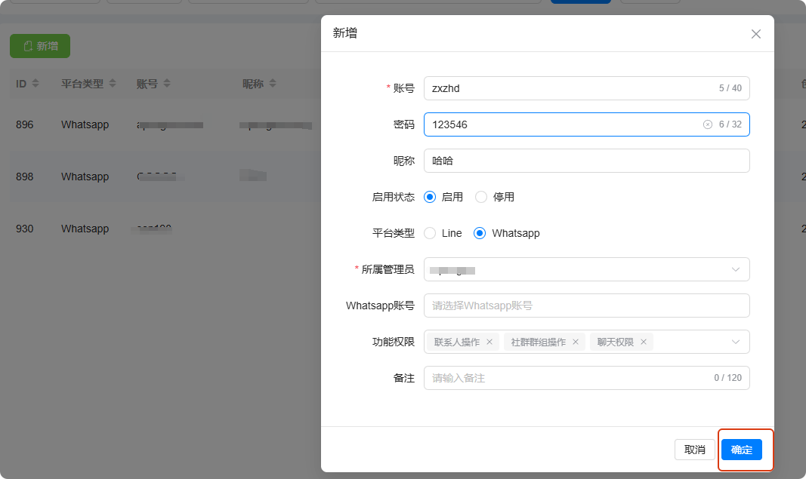

4. 页面提示创建成功后，即完成坐席账号新建。

## 二、将 WhatsApp 账号绑定到坐席

1. 在坐席列表中找到需要绑定的坐席账号，点击该账号旁边的【编辑】。

   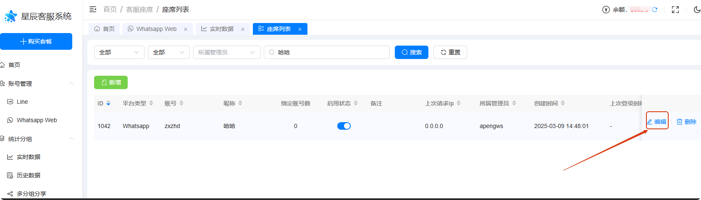

2. 在编辑弹窗中，点击【WhatsApp 账号】旁边的文本框，打开账号选择弹窗。

   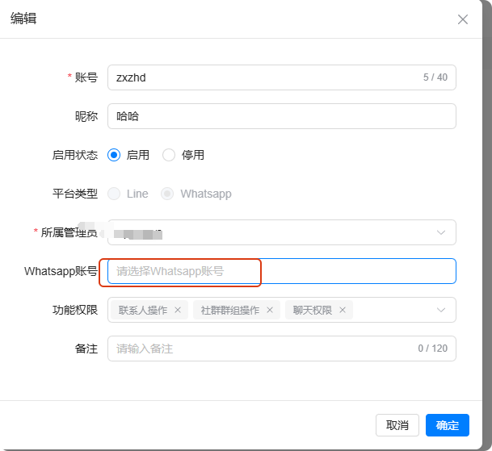

3. 勾选需要绑定到该坐席的 WhatsApp 账号，点击【确定】。

   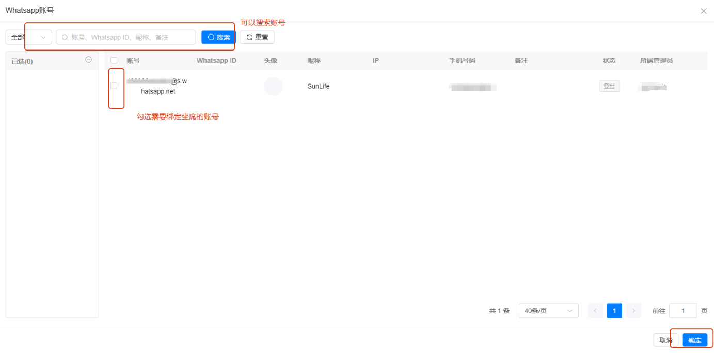

4. 回到编辑弹窗后，再次点击【确定】，保存绑定关系。

   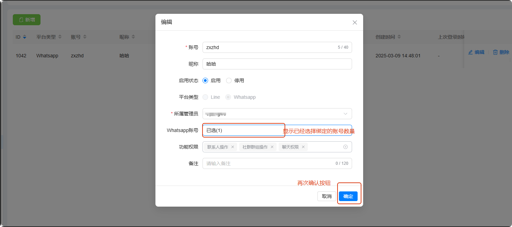

5. 页面提示【编辑成功】，且【绑定账号数】发生变化，即表示 WhatsApp 账号绑定成功。坐席登录【坐席系统】后，即可操作该 WhatsApp 账号。

   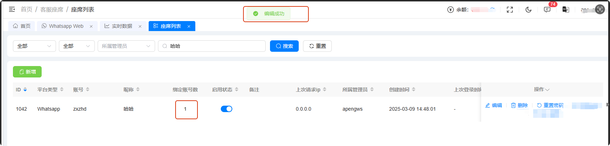

## 三、坐席功能权限说明

坐席权限会影响坐席系统中可使用的功能。创建或编辑坐席时，请根据业务需要勾选对应权限。

1. 好友权限

   勾选后，坐席系统可以使用查找联系人功能；不勾选则无法查找联系人。

   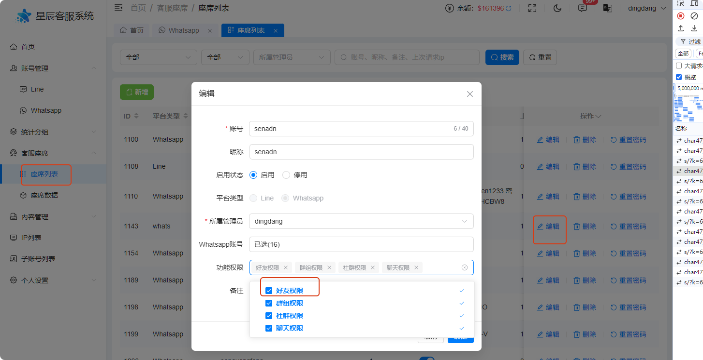
   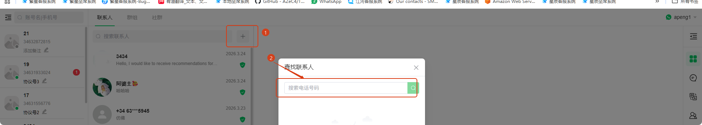

2. 群组 / 社群权限

   勾选后，坐席系统可以创建群组和创建社群；不勾选则无法使用相关功能。

   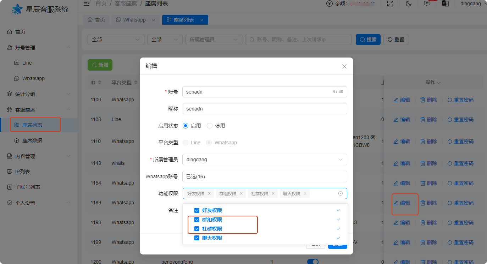
   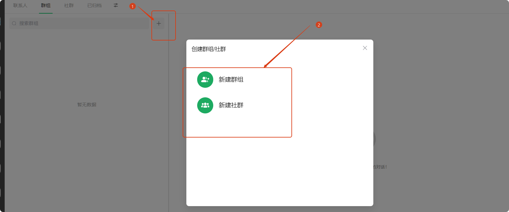

3. 聊天权限

   勾选后，坐席系统可以进行私聊和群聊；不勾选则无法使用聊天功能。

   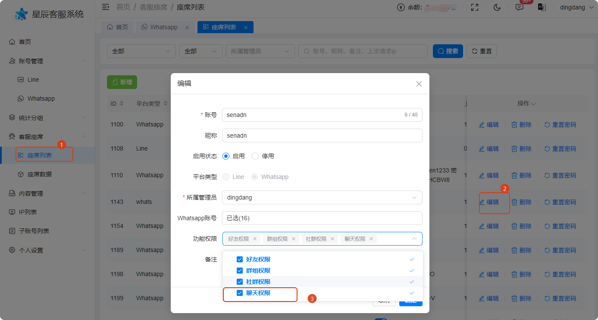
   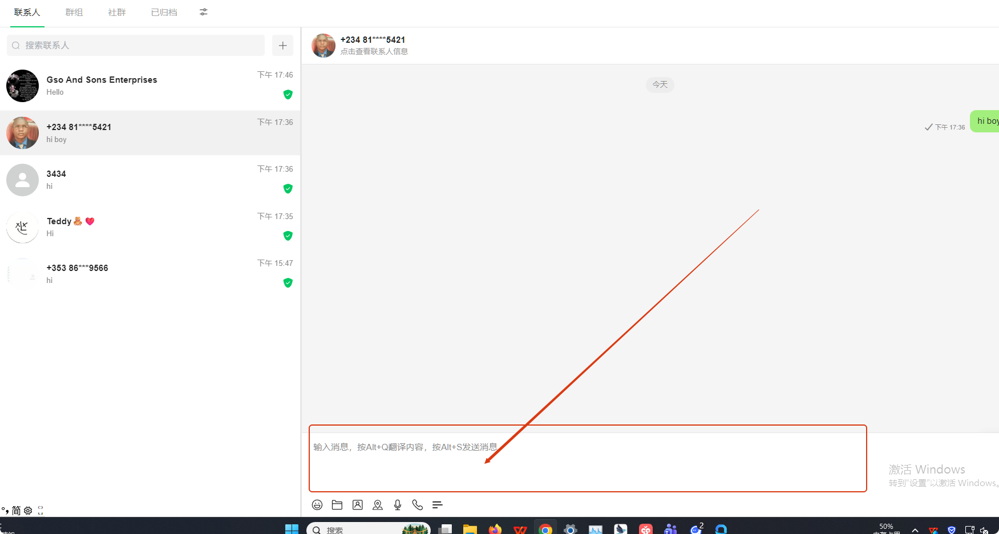
