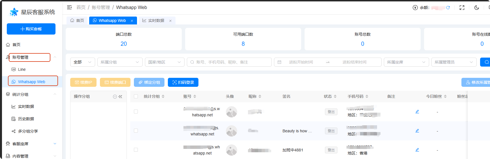
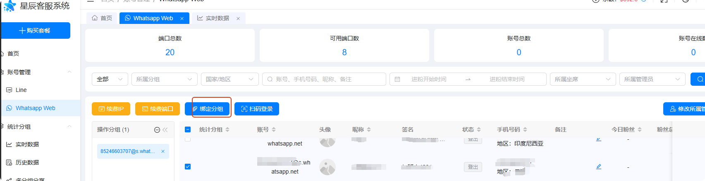
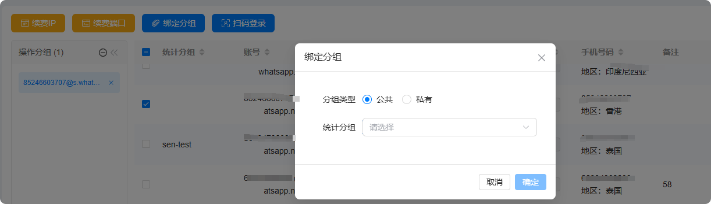
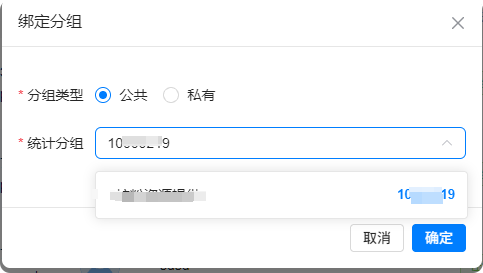

# 如何将whatsapp账号与分组（工单）进行绑定：

分类：星辰Whatsapp使用手册V2.0
更新时间：2026-04-02T06:13:23.150Z

1、接粉工单号找阿宝提供，要改动工单找阿宝

2、点击左侧菜单账号管理的【WhatsApp 】按钮，进入"WhatsApp账号列表“

3、勾选"未绑定分组"的WhatsApp账号后，点击【绑定分组】，触发【选择分组】弹窗

输入分配的工单号后，点击【确定】按钮，提示"绑定成功"即账号与分组成功绑定

