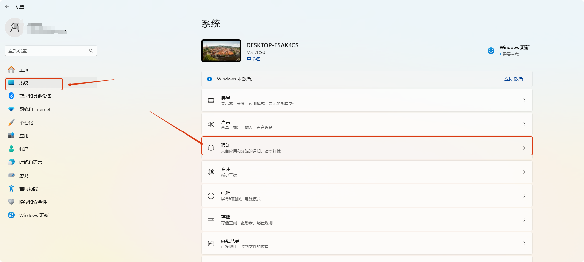
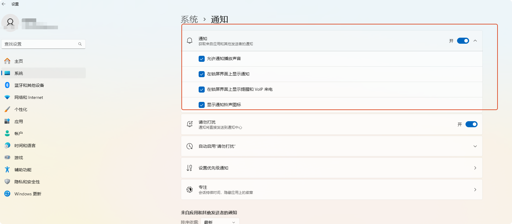
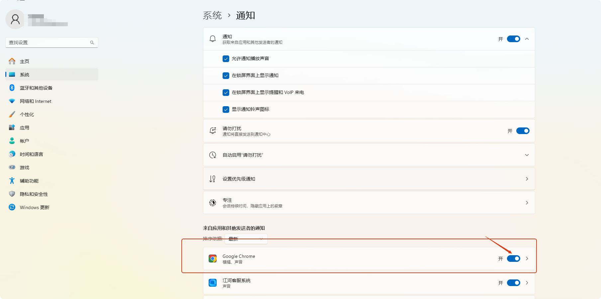
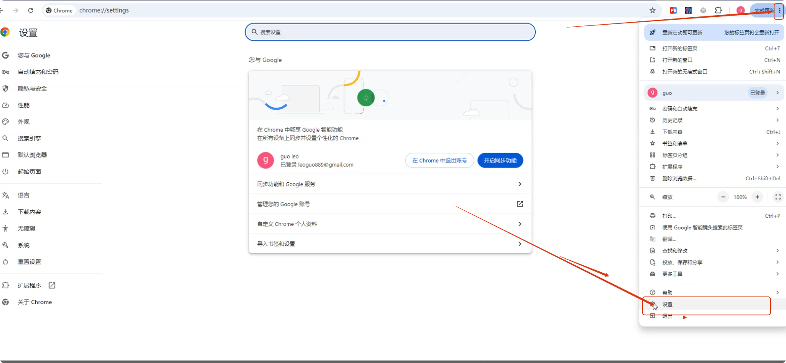
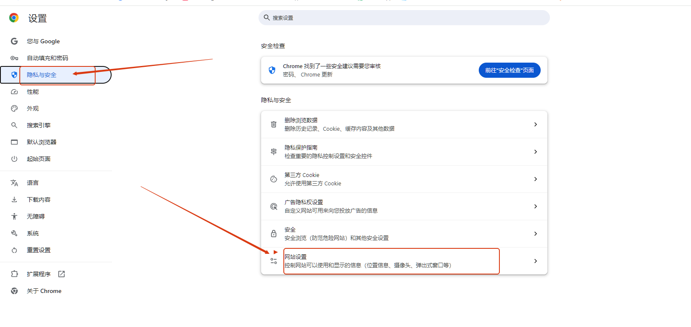
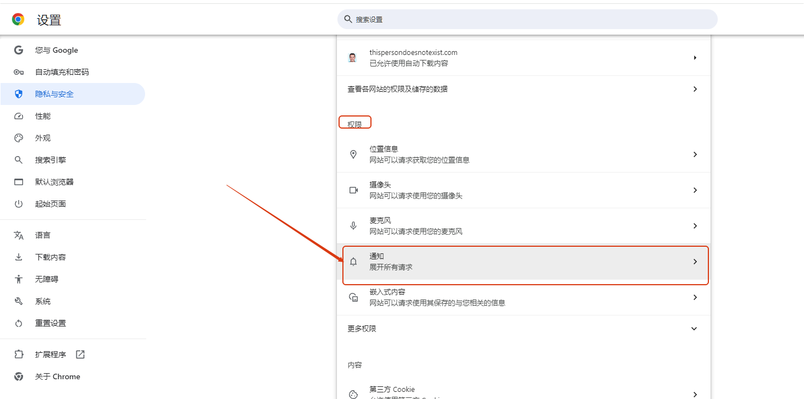
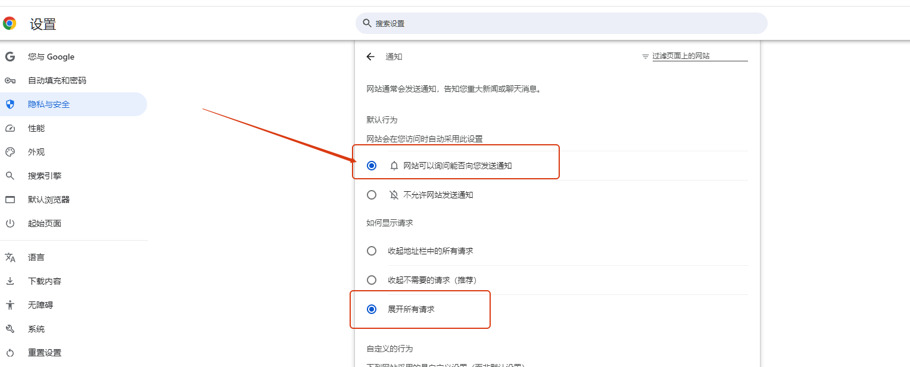
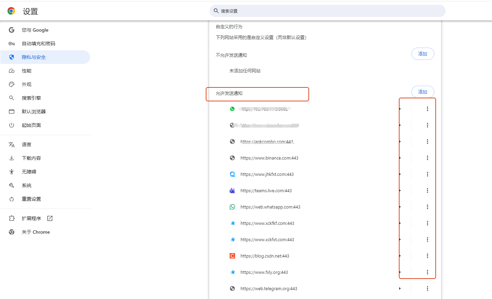

# 如何打开浏览器通知

分类：星辰Whatsapp使用手册V2.0
更新时间：2026-05-20T20:53:32+08:00

**本文说明如何开启 Windows 11 系统通知和 Chrome 网站通知。两处通知都开启后，浏览器才能正常弹出网站消息提醒。**

> 注意：通知只跟本地环境和浏览器有关，其他系统比如win10、其他浏览器比如edge自行谷歌搜索【如何打开浏览器通知】

## 一、开启 Win11 系统通知

1. 按下快捷键 `Win + i` 打开【设置】。
2. 在左侧选择【系统】，然后在右侧点击【通知】。

   

3. 确保顶部的【通知】开关处于【开启】状态。

   

4. 向下滚动到【来自应用和其他发件人的通知】列表。
5. 在列表中找到【Google Chrome】，并确保右侧开关处于【开启】状态。

   

## 二、开启 Chrome 网站通知

1. 打开 Google Chrome。
2. 点击右上角【⋮】更多图标，选择【设置】。

   

3. 点击左侧【隐私设置和安全性】。
4. 点击【网站设置】。

   

5. 在【权限】部分点击【通知】。

   

6. 选择【网站可以请求发送通知】。开启后，网站可以向浏览器申请通知权限。

   

7. 滚动到页面下方，检查需要接收通知的网站是否被误设为【不允许发送通知】。
8. 如果目标网站在不允许列表中，请将它移到【允许发送通知】列表。

   

## 三、检查通知是否生效

完成以上设置后，重新打开需要接收通知的网站。如果浏览器弹出通知授权提示，请选择允许。

> 提示：如果仍然收不到通知，请同时检查 Windows 专注助手、浏览器通知权限和网站自身的通知设置。
