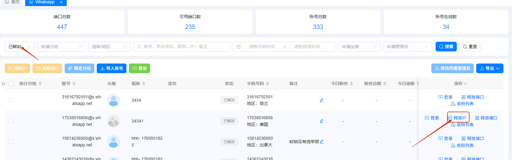
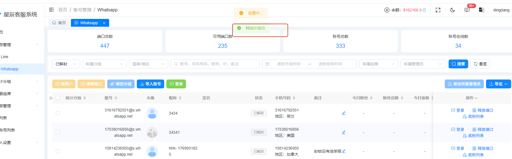
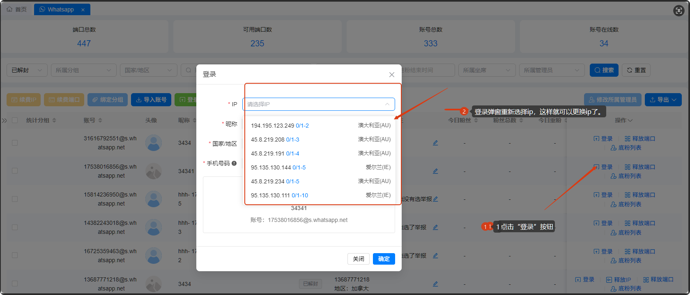

# 如何更换 IP

分类：星辰Whatsapp使用手册V2.0
更新时间：2026-05-20T20:59:50+08:00
ID：2388935951e7ec39c9beafb2

**本文说明账号解封后如何释放旧 IP，并在重新登录时选择新的 IP。**

> 注意：账号在线状态下不允许更换 IP。需要先释放 IP，再重新登录并选择新 IP。

## 一、释放已解封账号的 IP

1. 在账号列表中筛选【已解封】状态的账号。
2. 找到需要更换 IP 的账号。
3. 点击【释放 IP】按钮。
4. 系统弹出确认窗口后，点击【确认】。
5. 页面提示成功后，表示旧 IP 已释放。

   
   

## 二、重新登录并选择新 IP

1. 回到账号列表，点击该账号的【登录】按钮。
2. 页面弹出登录窗口后，重新选择需要使用的新 IP。
3. 确认登录信息无误后，继续完成登录。

   
