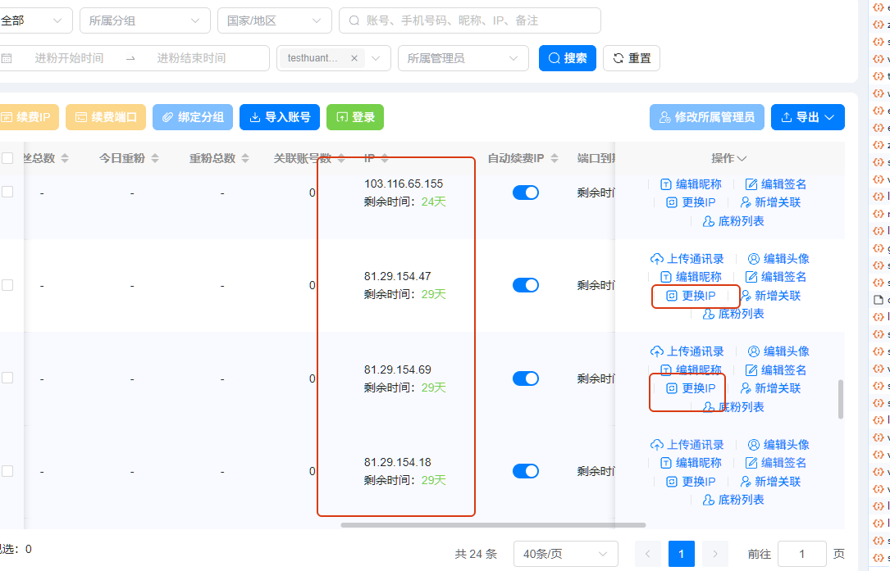
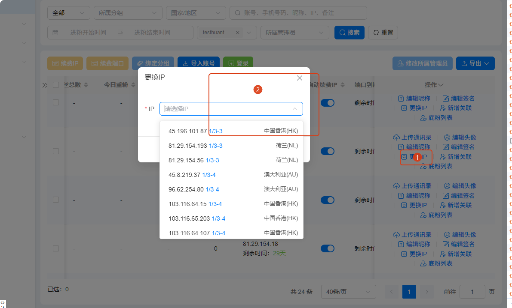
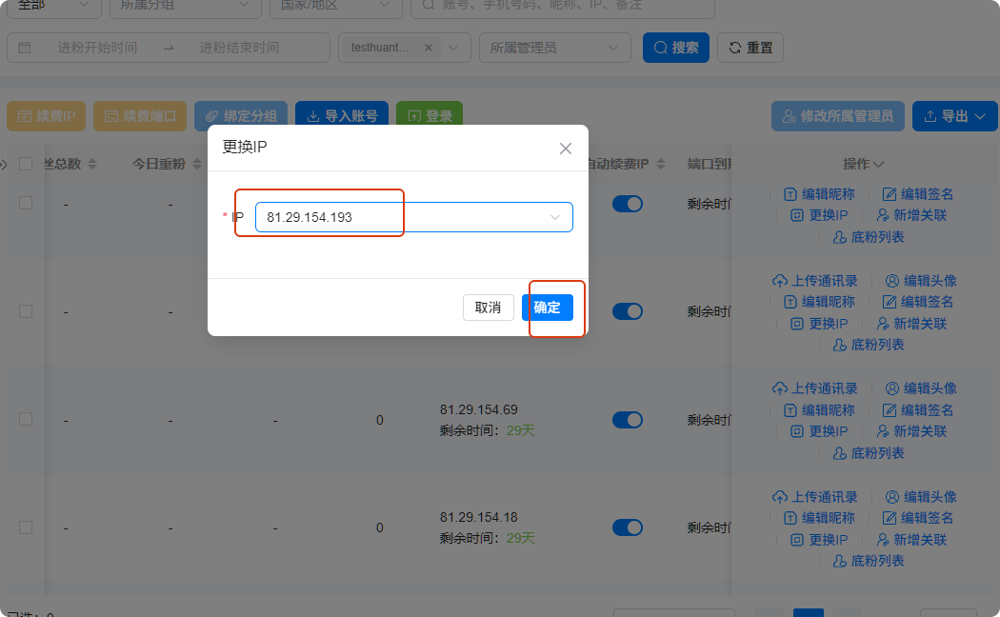
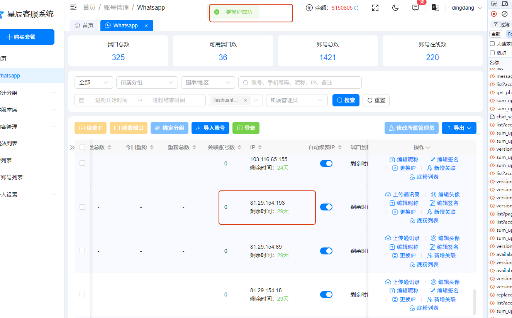

# 如何更换IP

分类：星辰Whatsapp使用手册V2.0
更新时间：2026-09-23T18:55:00+08:00
ID：c328470fe1e208e449be7857

## 一、功能说明

当账号发消息卡在线并提示<strong class="doc-blue-strong">“stream error”</strong>时，可以直接使用“更换 IP”功能处理。

## 二、更换 IP 操作

### 1. 打开更换 IP 入口

占用 IP 的账号都会显示“更换 IP”入口。

### 2. 选择新的 IP

点击“更换 IP”按钮，在弹窗中选择要更换的 IP。

点击“确认”按钮完成更换。

### 3. 确认结果

页面提示 IP 更换成功后，即可继续使用账号。

