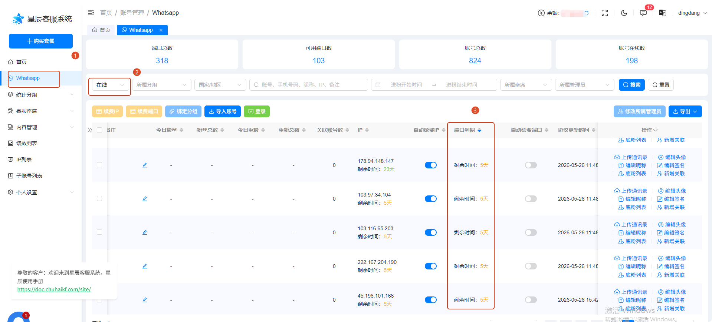
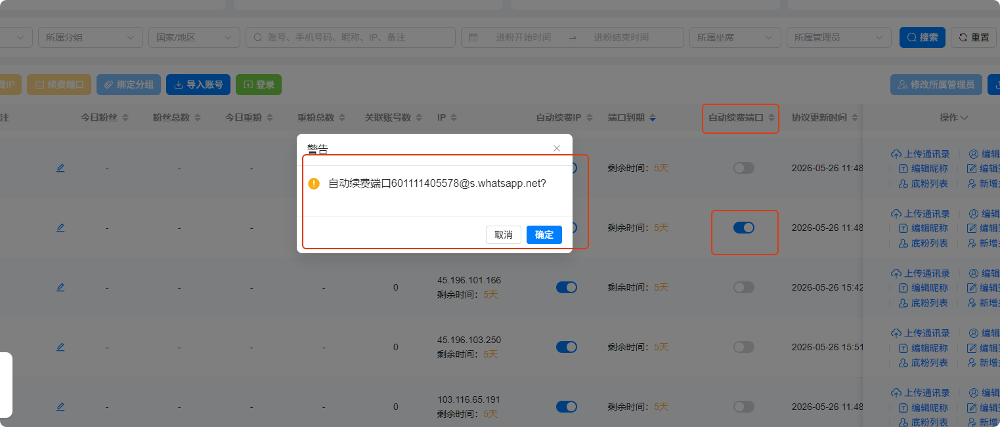
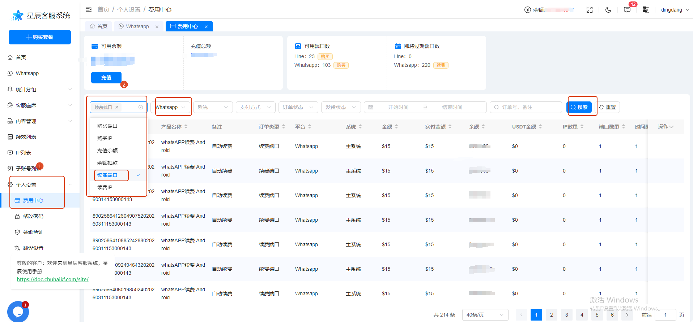

# 如何查看端口是否过期

分类：星辰Whatsapp使用手册V2.0
更新时间：2026-05-27T00:00:00+08:00
ID：a1facaa356e3b84c5985b672

## 查看端口是否过期

1. 打开 WhatsApp 账号列表，筛选“在线”的账号。
2. 滑动到“端口过期”这一列，可以通过排序查看到期时间。

## 开启自动续费

开启自动续费后，系统会在到期前一天续费一个月，同时扣除对应余额。

1. 找到需要续费的账号，滑动到“自动续费端口”这一列。
2. 操作开关，可以开启或关闭自动续费。系统会出现二次确认弹窗，点击确认按钮。

## 查询扣费记录

自动续费端口的扣费记录查询路径：

个人设置 -> 费用中心 -> 订单类型选择“续费端口” -> 平台选择“WhatsApp” -> 搜索结果中备注为自动续费的订单即为扣费记录。

