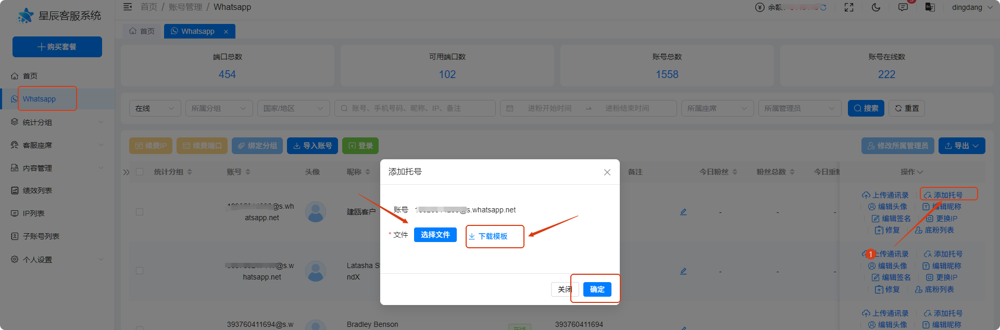

# 如何添加托号

分类：星辰Whatsapp使用手册V2.0
更新时间：2026-09-23T18:49:39+08:00
ID：6a82f2f23892f81caa27c4a0

**添加托号是把带盾牌的号码加入联系人列表，主要用途是拉号进群。**

> **注意：添加托号与上传通讯录不同，也不代表添加好友。不能通过此功能导入后私聊发信息，否则会有封禁风险。**

## 一、功能说明

添加托号仅将<strong class="doc-blue-strong">带盾牌的号码</strong>加入联系人列表，<strong class="doc-blue-strong">没有添加好友</strong>，主要用于<strong class="doc-blue-strong">拉号进群</strong>。

## 二、操作步骤

1. 确认操作账号处于<strong class="doc-blue-strong">在线</strong>状态，在账号列表界面点击“添加托号”按钮，打开弹窗。
2. 下载模板文件，按模板填写信息，再选择要上传的文件。
3. 点击“确认”按钮，前往坐席的联系人列表，查看是否出现已上传的托号。

> **只上传有盾牌的账号。如果联系人列表没有显示，可以等待 5 分钟后刷新界面再查看。**

## 三、模板示例

填写格式请参考以下模板截图：

