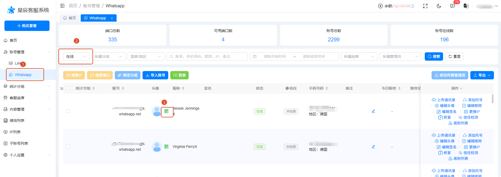
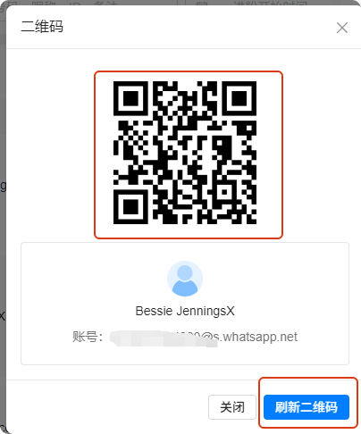
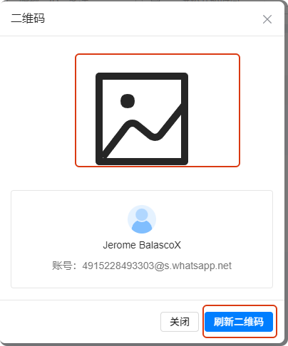
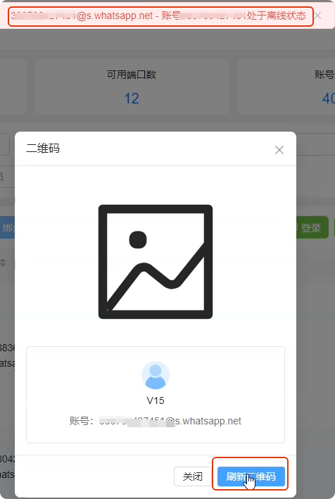

# 如何生成自己的二维码

分类：星辰Whatsapp使用手册V2.0
更新时间：2026-09-23T17:30:00+08:00
ID：6ab36fff9c745b33a196b2b6

## 一、二维码入口

1. 打开 WhatsApp 账号列表。
2. 搜索状态为<strong class="doc-blue-strong">“在线”</strong>的账号。
3. 点击账号头像旁边的绿色二维码图标。

## 二、使用二维码

弹出二维码窗口后，可以使用手机上的其他账号扫码添加好友，也可以点击刷新二维码生成新的二维码。

## 三、异常情况处理

### 情况 1：打开后没有显示二维码

直接点击<strong class="doc-blue-strong">“刷新二维码”</strong>，重新加载二维码。

### 情况 2：刷新失败并提示账号处于离线状态

如果点击刷新二维码后提示<strong class="doc-blue-strong">“账号处于离线状态”</strong>，同时账号状态变成离线：

1. 先将账号重新上线。
2. 账号恢复在线后，再次点击<strong class="doc-blue-strong">“刷新二维码”</strong>。

