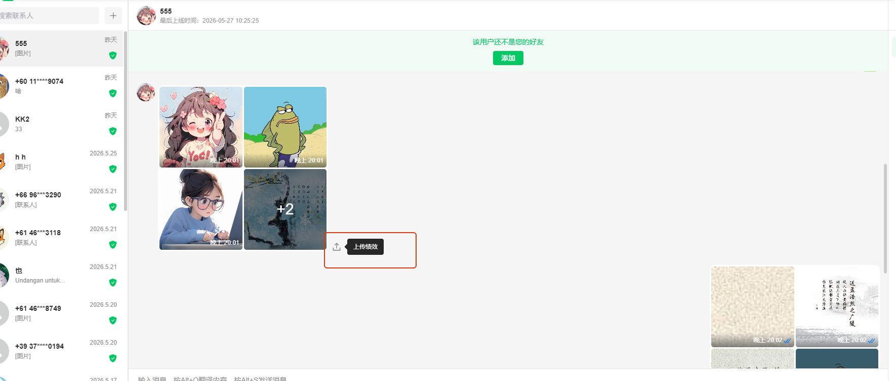
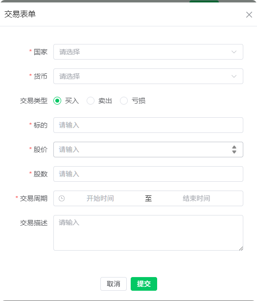
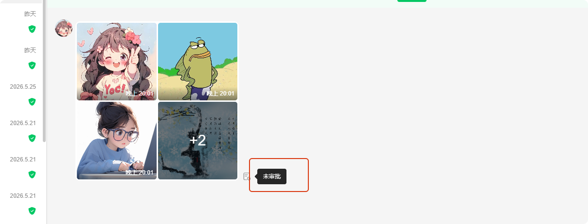
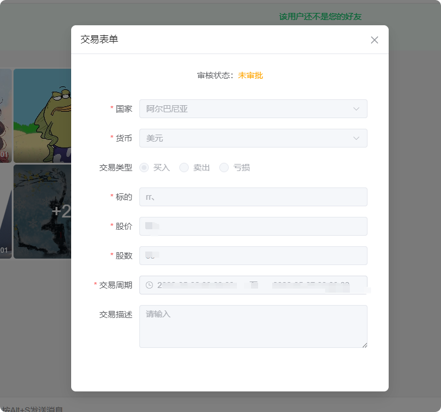
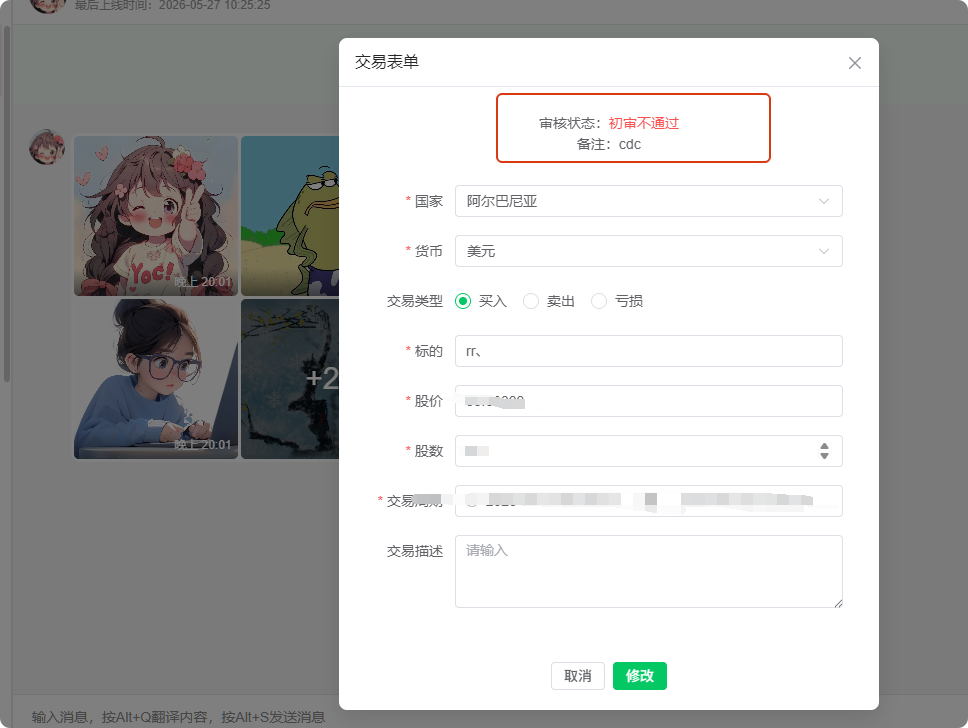
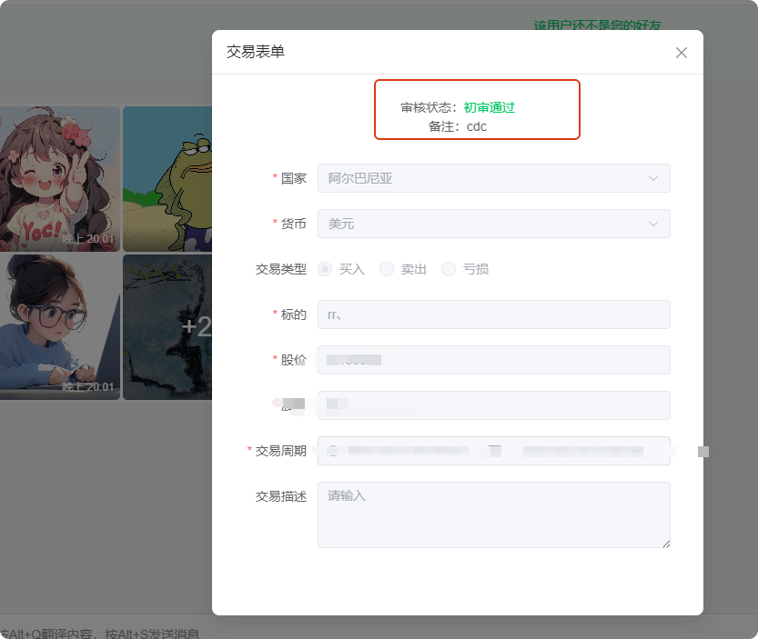

# 如何绩效上传归类使用手册

分类：星辰Whatsapp使用手册V2.0
更新时间：2026-05-27T00:00:00+08:00
ID：5ea75dc9a9082425d6b79471

来源：https://xingchen2.tawk.help/article/%E7%BB%A9%E6%95%88%E4%B8%8A%E4%BC%A0%E6%95%99%E7%A8%8B

## 操作步骤

1. 对方发的图片显示上传按钮后，可以点击按钮上传绩效。

   注意：发了图片后，需要回复信息，或者对方再发送除图片、视频之外的信息，才会显示上传按钮。对方发送图文加文字时，会直接显示上传按钮。

   

2. 填写上传信息，按上传表单填写正确信息，点击提交。

   

3. 信息提交后会进入审核状态，后台审核后，可以查询状态。

   

   

4. 如果出现审核不通过，需要重新修改提交。

   

5. 等待出现审核通过，即表示数据上传正确并已审核通过。

   
