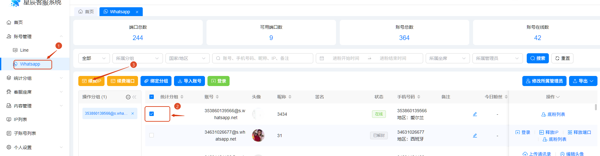
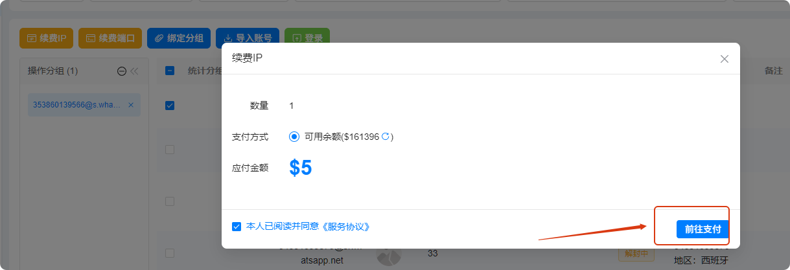
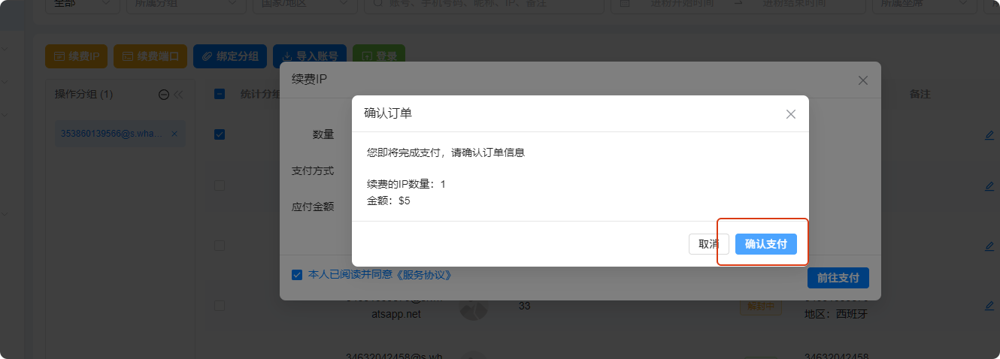
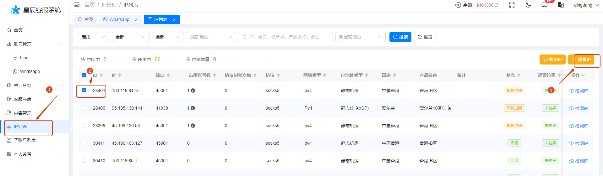
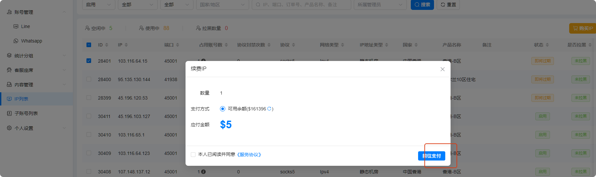
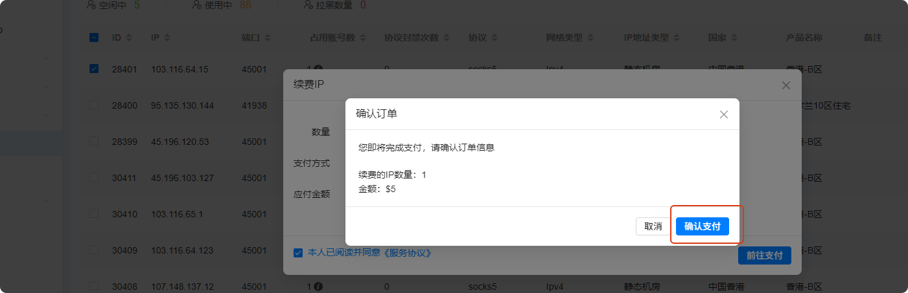
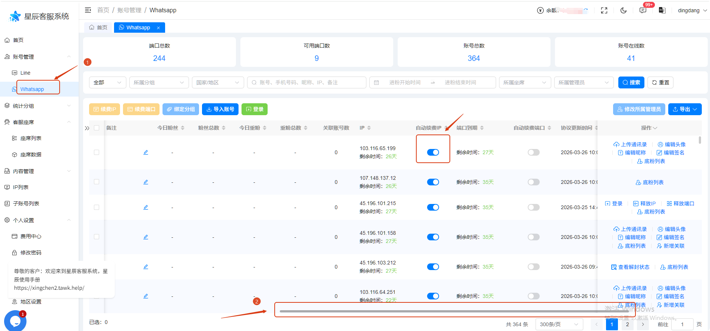
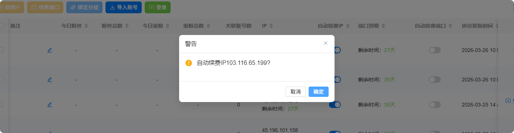
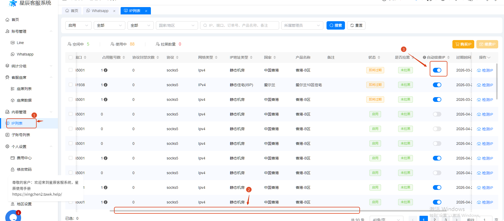
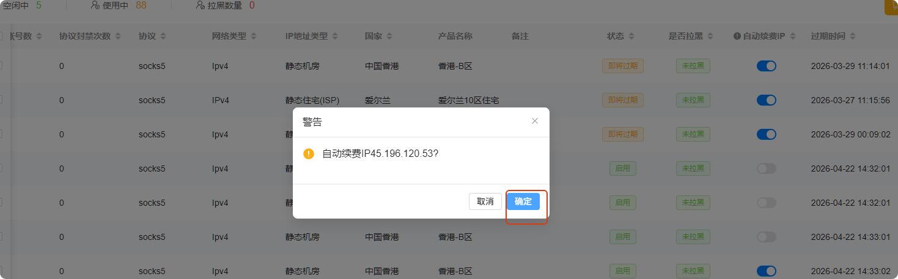

# 如何续费 IP 和开启自动续费

分类：星辰Whatsapp使用手册V2.0
更新时间：2026-05-20T20:58:11+08:00

**本文说明如何手动续费 IP，以及如何开启 IP 自动续费。建议提前续费或开启自动续费，避免 IP 到期影响 WhatsApp 账号正常使用。**

## 一、通过 WhatsApp 账号列表续费 IP

1. 进入【WhatsApp】账号列表。
2. 选中需要续费 IP 的账号。
3. 点击【续费 IP】按钮。

   

4. 页面弹出支付界面后，点击【前往支付】。

   

5. 确认订单无误后，点击【确认支付】。
6. 支付成功后，即完成 IP 续费。正常情况下续费周期为一个月。

   

## 二、通过 IP 列表续费 IP

1. 进入【IP 列表】。
2. 选中需要续费的 IP。
3. 点击【续费 IP】按钮。

   

4. 页面弹出支付界面后，点击【前往支付】。

   

5. 确认订单无误后，点击【确认支付】。
6. 支付成功后，即完成 IP 续费。正常情况下续费周期为一个月。

   

## 三、在 WhatsApp 账号列表开启自动续费

1. 打开【WhatsApp】账号列表。
2. 横向滑动底部滚动条，找到【自动续费 IP】列。
3. 点击【开启】按钮。

   

4. 页面弹出确认窗口后，点击【确认】。
5. 确认后，该账号的 IP 自动续费即开启成功。

   

## 四、在 IP 列表开启自动续费

1. 打开【IP 列表】。
2. 横向滑动底部滚动条，找到【自动续费 IP】列。
3. 点击【开启】按钮。

   

4. 页面弹出确认窗口后，点击【确认】。
5. 确认后，该 IP 自动续费即开启成功。

   

> 注意：开启自动续费后，请保持账号余额充足。余额不足可能导致续费失败，进而影响账号正常使用。
