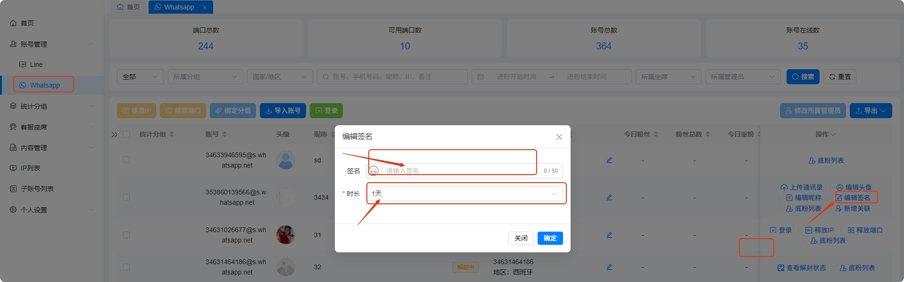
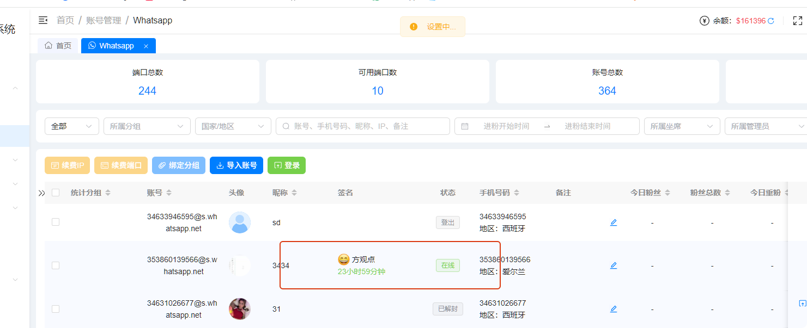
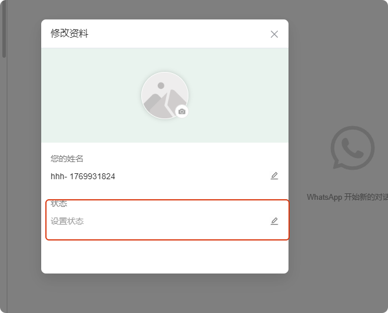
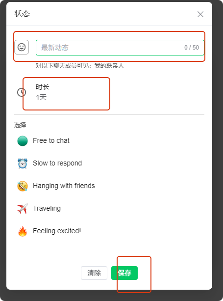
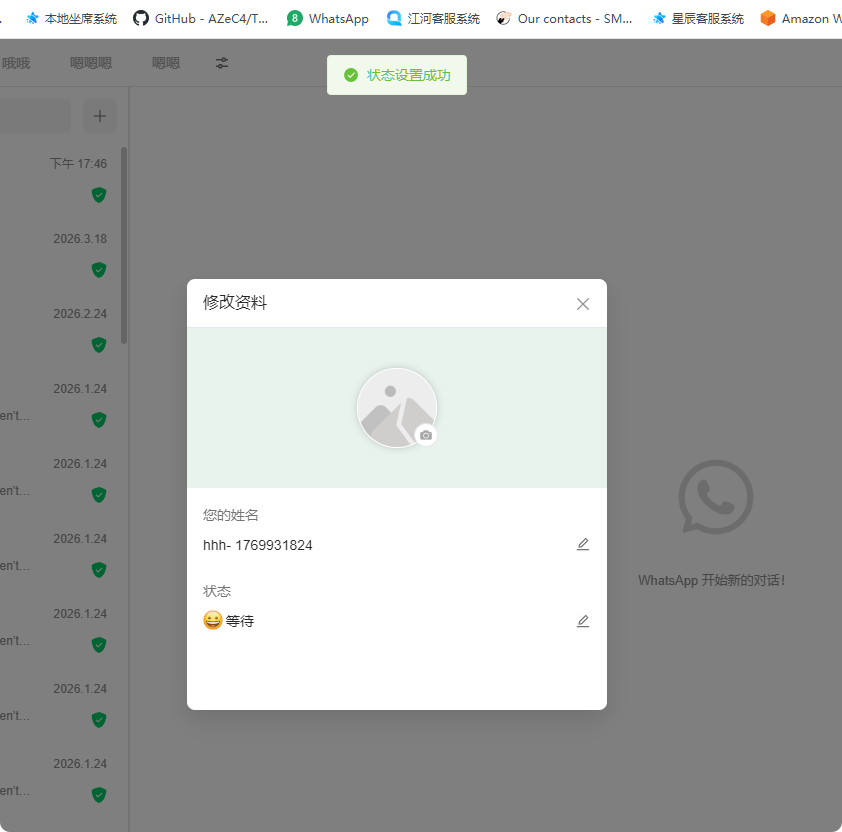

# 如何设置签名

分类：星辰Whatsapp使用手册V2.0
更新时间：2026-05-20T22:02:24+08:00
ID：130e72704a7ad203b64004ca

**本文说明如何在后台或坐席系统中设置 WhatsApp 账号签名，以及签名同步和过期后的显示规则。**

> 提示：同一个账号在后台和坐席系统中的签名状态是同步的，任意一端修改后都会影响该账号当前签名。

## 一、在后台设置签名

1. 进入后台【WhatsApp】账号列表。
2. 找到需要设置签名的账号。
3. 点击【编辑签名】，打开签名设置弹窗。

   

4. 输入需要展示的签名内容。
5. 选择签名生效时长。
6. 点击【确认】保存设置。
7. 页面显示签名内容和倒计时后，表示签名设置成功。

   

## 二、在坐席系统设置签名

1. 登录坐席系统。
2. 找到需要设置签名的账号。
3. 对账号点击鼠标右键。
4. 点击【修改资料】，打开账号资料弹窗。

   

5. 在弹窗中点击【设置状态】。

   

6. 输入状态内容。
7. 选择状态生效时间。
8. 点击【保存】。

   

9. 页面提示设置成功后，表示坐席端签名已生效。

   

## 三、签名同步和过期说明

1. 后台和坐席系统设置的是同一个账号签名，状态会保持同步。
2. 签名到期后会自动失效，其他人再查看该账号时会看到默认签名。
3. 例如签名设置为 24 小时，【笑脸在线】在第 24 小时内有效；超过 24 小时后即为已过期。
4. 如果签名仍需继续展示，请在过期前重新设置或延长时间。

   
