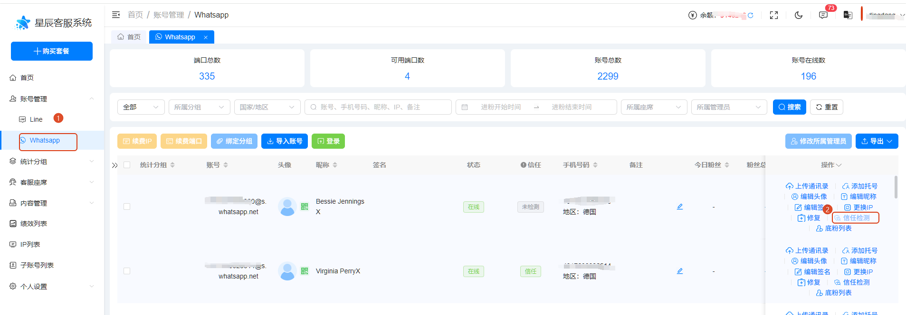
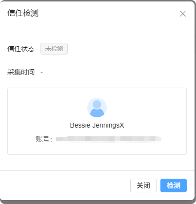
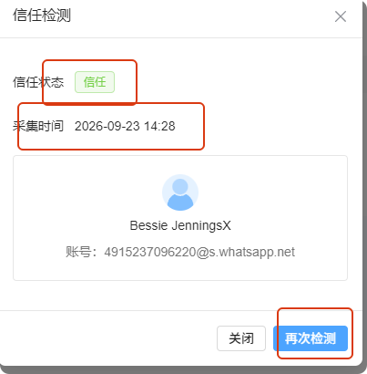
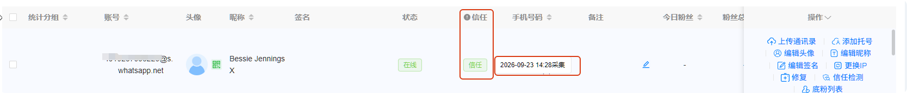
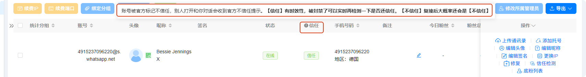

# 如何进行信任检测

分类：星辰Whatsapp使用手册V2.0
更新时间：2026-09-23T15:45:15+08:00
ID：6ab372e7a6acbf33a85160ac

> **注：所有状态下账号都可以检测，也可以多次进行检测。**

## 一、打开信任检测

打开 WhatsApp 账号列表，点击右边操作栏的“信任检测”按钮。

## 二、开始检测

弹出检测弹窗，点击“检测”按钮。

## 三、查看检测结果

得到检测结果：显示信任状态、采集时间，同时“检测”按钮变成“再次检测”。

## 四、查看账号信任状态

关闭弹窗后，账号信任状态变成检测后的结果，鼠标放上去还显示采集时间。

## 五、信任列及注意事项

账号列表新增“信任”列，在状态后面，鼠标放在“!”上有提示：账号被官方标记不信任，别人打开和你对话会收到官方不信任提示。

> **【信任】有时效性，被封禁了可以实时再检测一下是否还信任。**

如果封号状态是<strong class="doc-blue-strong">【诈骗】</strong>，但仍显示【信任】，应该是检测结果存在延迟，需要<strong class="doc-blue-strong">重新检测一次</strong>，确认账号是否已经变为【不信任】。

> **【不信任】复接后大概率还会是【不信任】。**

目前不信任号码恢复成信任号码的概率<strong class="doc-blue-strong">不到万分之五（0.05%）</strong>，基本可以认为：<strong class="doc-blue-strong">被官方标记为【不信任】后不会恢复</strong>。

