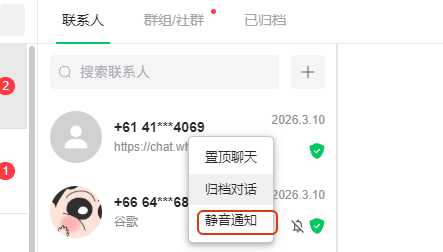
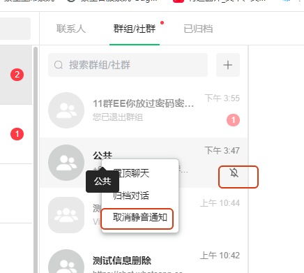

# 如何静音通知

分类：星辰Whatsapp使用手册V2.0
更新时间：2026-05-20T20:26:05+08:00
ID：24a22d888bf7ec11a807a1b6

**本文说明如何将联系人或群组会话设置为静音通知，以及如何取消静音。适合需要减少消息提醒干扰，但仍保留会话记录的场景。**

## 一、设置静音通知

1. 在会话列表中找到需要静音的联系人或群组。
2. 右键点击该会话。
3. 在菜单中点击【静音通知】。

   

## 二、确认静音状态

1. 设置成功后，会话列表中会显示静音标识。
2. 后续该会话有新消息时，系统不会按正常通知方式提醒。

   

## 三、取消静音通知

1. 找到已静音的联系人或群组。
2. 右键点击该会话。
3. 点击取消静音相关选项，即可恢复通知。

> 提示：静音通知只影响提醒方式，不会删除会话，也不会影响消息接收。
