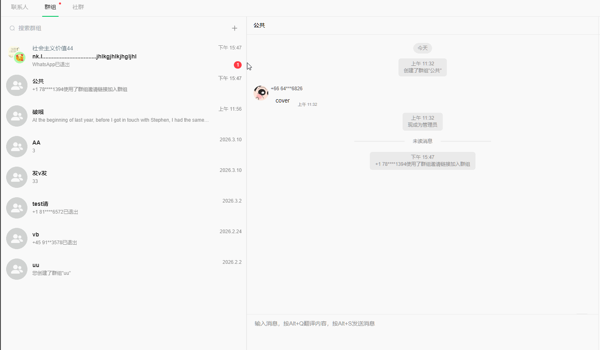

# 如何调节群名（任意对话）的显示长度

分类：星辰Whatsapp使用手册V2.0
更新时间：2026-05-20T20:08:54+08:00

**当联系人、群组或社群名称过长时，可以通过会话列表显示设置调节名称展示长度，方便在列表中快速识别不同会话。**

## 一、适用范围

以下会话名称都可以通过该设置调整显示长度：

- 联系人
- 群组
- 社群
- 其他会话列表中的名称

## 二、调节显示长度

1. 进入会话列表页面。
2. 找到会话列表显示长度相关设置。
3. 根据需要调整名称显示长度。
4. 调整后，联系人、群组或社群名称会按照新的长度展示。

   

> 提示：如果群名或联系人名称过长，建议适当增加显示长度，便于区分相似会话。
