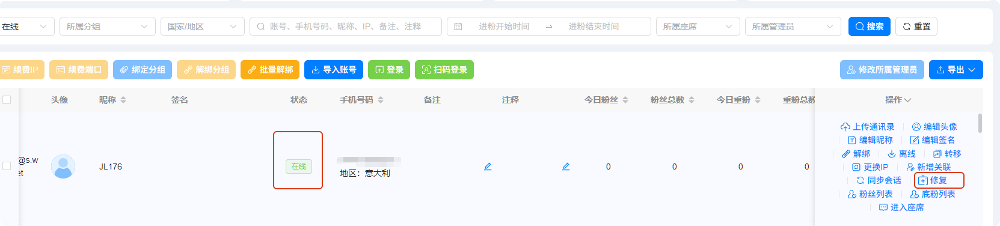
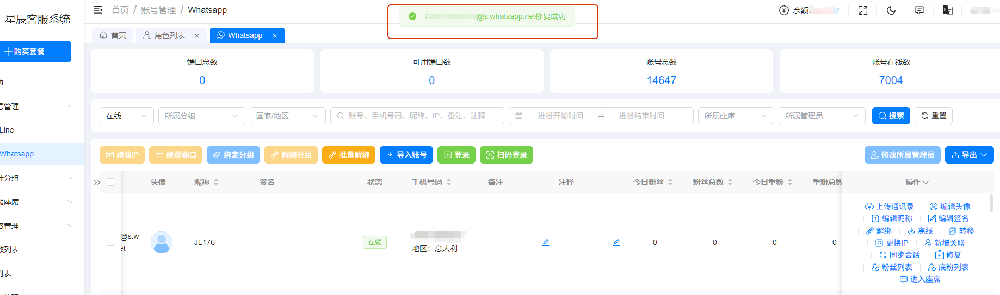
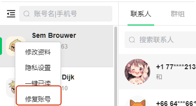
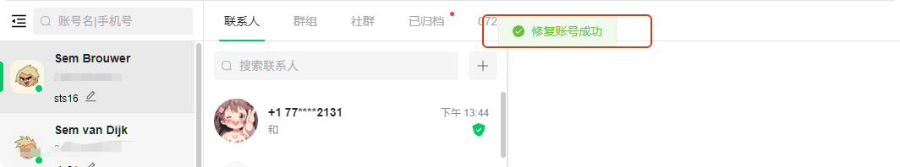

# 消息重连应该怎么办

分类：星辰Whatsapp使用手册V2.0
更新时间：2026-09-23T18:55:00+08:00
ID：ebc3991d59db62c8642960cc

## 一、后管系统操作

在线状态的账号都会显示“修复”按钮。

点击“修复”按钮，页面提示修复成功即可。

## 二、坐席系统操作

1. 在账号列表中选中需要处理的账号并点击右键。
2. 选择“修复账号”。
3. 页面提示修复账号成功后，完成消息重连。

