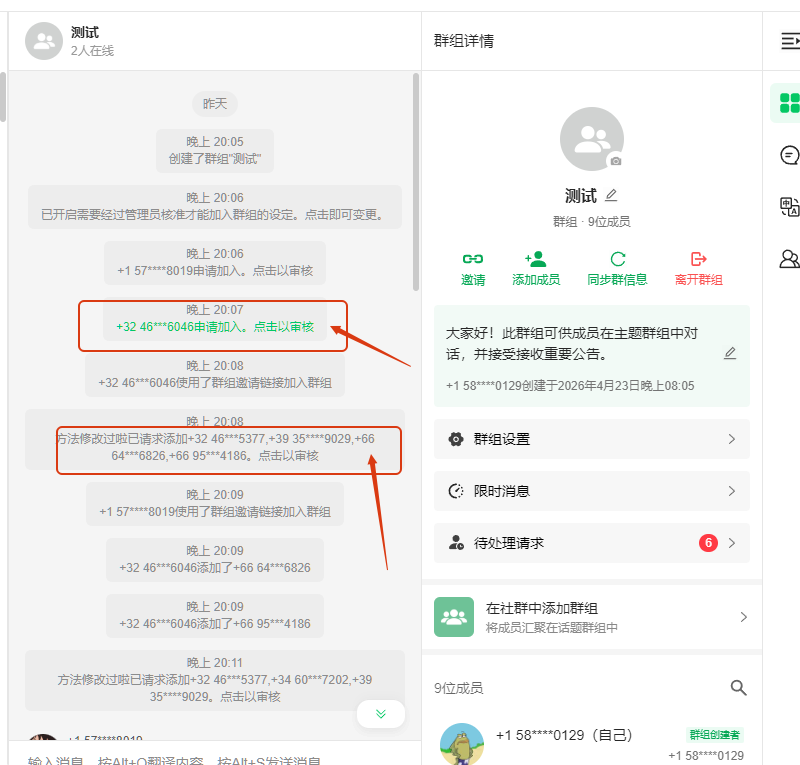
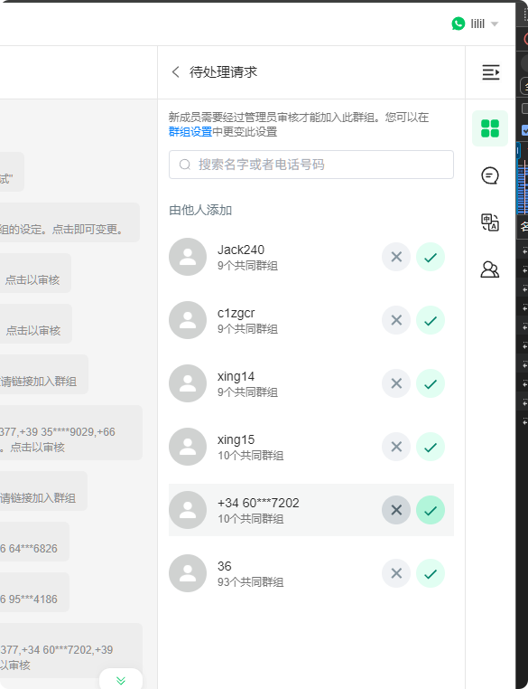
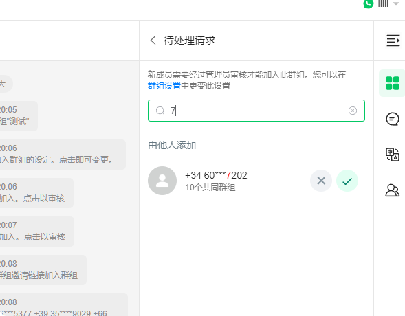

# 群组审批加入操作说明文档

分类：星辰Whatsapp使用手册V2.0
更新时间：2026-04-24T06:07:55.488Z

**一、申请进群通知信息**

1、有人通过邀请连接申请进群会有通知消息；或者群中普通成员请求添加其他人员进群也会有通知消息

2、点击跳转到审批界面

**二、审批界面按时间倒序排序，支持模糊搜索**

**三、注意事项**

**审批太快会受限制，控制20秒审批一个**
