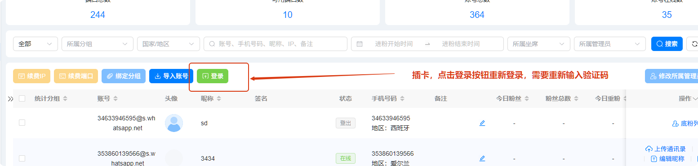

# 账号所有状态的含义

分类：星辰Whatsapp使用手册V2.0
更新时间：2026-05-20T21:35:04+08:00
ID：14954024065c4b5ad2b53205

**本文说明账号列表中常见状态的含义，以及遇到封禁、解封中、已解封等状态时应该如何处理。**

## 一、登出

账号显示【登出】通常表示账号被官方踢出，或被人为转走。此时需要手机插卡复接后再重新登录。

1. 在账号列表中找到【登出】状态的账号。
2. 准备对应手机和 SIM 卡。
3. 按复接登录流程重新登录账号。
4. 卡没信号了或者找不到到卡了等各种原因已经无法接码了，只能在【F-对接群】中反馈把号码设置成【永久封禁】状态，然后用其他号码继承粉丝，除此之外别无办法

   

## 二、离线

账号显示【离线】通常有两类原因：

- 账号被官方临时限制。
- 代理长时间失效导致账号下线。

一般情况下，如果是账号使用不当导致的官方限制，限制解除后任意操作会自动恢复上线。

## 三、封禁

账号显示【封禁】表示账号已被封，通常无法正常进行私聊或群聊。

判断方式：

1. 查看坐席账号头像是否出现红点。
2. 将鼠标移动到红点上，查看是否提示【封禁】。
3. 如果账号无法正常私聊或群聊，同时出现封禁提示，说明该账号已被封禁。

   

处理方式：

1. 进入账号列表页面。
2. 将状态筛选为【封禁】，点击【搜索】。
3. 找到需要申请解封的账号。
4. 点击【申请解封】，打开申请解封弹窗。
5. 解封理由可以不填写，直接点击【确认】提交申请。

   

## 四、解封中

账号显示【解封中】表示解封申请已提交，正在等待官方处理。该状态不会自动变为【已解封】，需要手动查询解封结果。

1. 提交申请后，账号会进入【解封中】状态。
2. 点击【查看解封状态】，手动查询当前是否已经完成解封。
3. 建议至少每半天查询一次状态，确认是否已经变为【已解封】。
4. 解封申请和解封状态查询都有有效期，请及时查询，避免超过有效期后无法继续查看或处理。

   

## 五、已解封

账号显示【已解封】表示账号已经完成解封，可以尝试重新登录。

> 注意：已解封账号需要手机插卡复接登录。

1. 在账号列表中筛选并找到【已解封】账号。
2. 点击【登录】，打开登录弹窗。
3. 检查登录信息是否正确。
4. 如果此前释放过 IP，需要重新选择 IP。
5. 确认无误后，点击【确认】完成重新登录。

   

## 六、永久封禁

账号显示【永久封禁】表示账号被官方永久封禁。该状态下账号无法按普通解封流程恢复。

如果需要保留原账号会话记录，可以通过关联账号方式，将永久封禁账号的会话记录关联到新账号下。

> 提示：永久封禁与普通封禁不同，请先确认状态，再选择对应处理方式。

## 相关文档

如果需要将【永久封禁】账号的会话记录继承到新账号下继续跟进，请参考：[如何永封继承](./如何永封继承.md)
