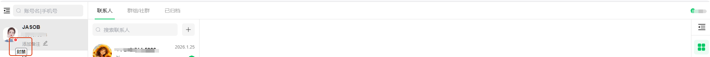
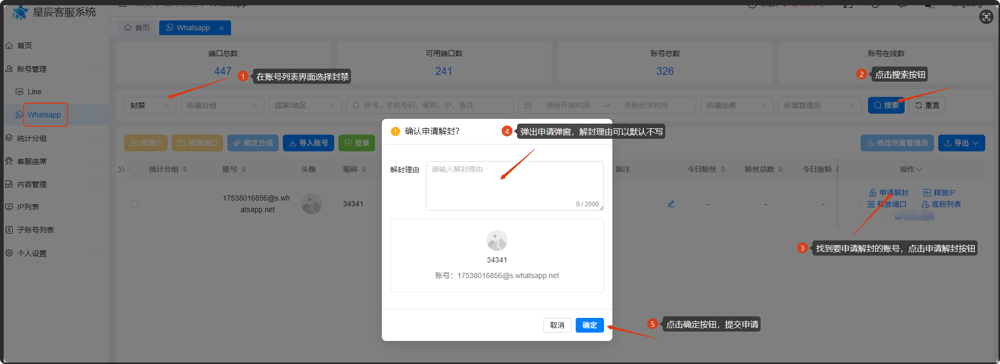
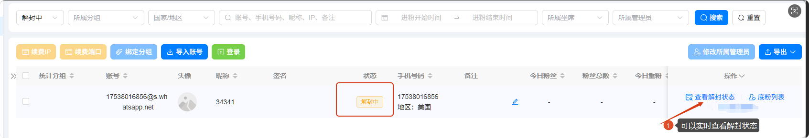
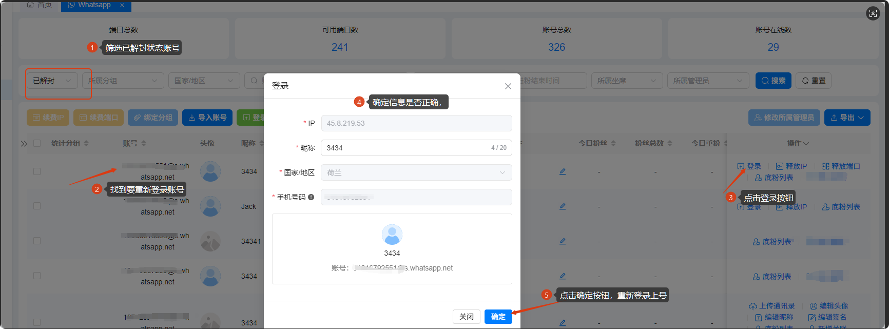

# 账号被封，解封流程

分类：星辰Whatsapp使用手册V2.0
更新时间：2026-03-16T09:09:44.158Z

## 解封申请和查询解封状态有有效期，起码保持一天查看一次状态，以免过期

## 怎么判断是被封号了

当坐席账号头像出现红点，鼠标移动到红点上，有浮标提示“封禁”，且账号无法正常使用私聊和群里，这时候号就被封禁了。

## 封号了如何申请解封

1、到账号列表界面，状态选择封禁，点击搜索按钮

2、找到要申请解封的账号，点击“申请解封”按钮，弹出申请解封弹窗

3、解封理由那里可以不填，点击确认按钮就可以提交申请

4、提交申请后，进入解封中状态，可以点击“查看解封状态”按钮，实时查看是否解封

## 已解封如何重新上号

注：需要手机插卡复接登录

1、账号列表，通过筛选找到已解封的账号，点击登录按钮，弹出登录弹窗

2、查看登录信息是否正确（如果释放了ip需要重新选择ip），点击确认按钮。

