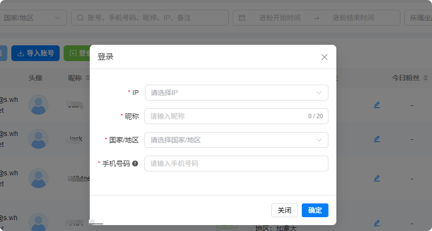
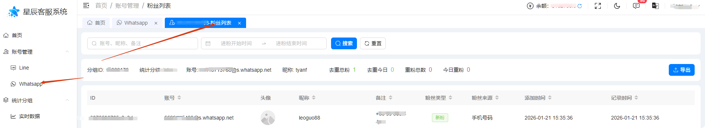
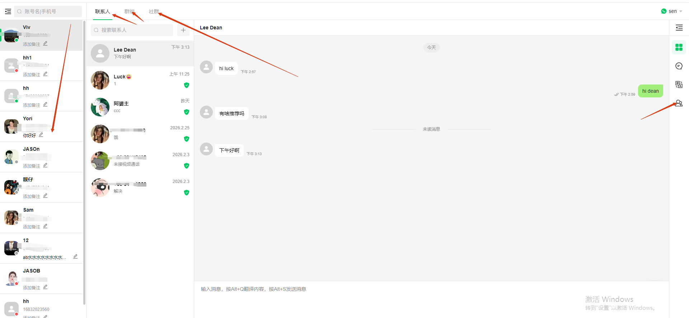

# 可脱离手机操作账号和综合性强等优势

分类：星辰whatsapp协议优势
更新时间：2026-03-09T08:25:18.123Z

**一、登录上号后，可脱离手机操作账号**

不需要安装插件，不需要先创建分组激活码，直接后台登录上号，上号后可脱离手机操作

**二、综合性强，所有功能都可以在web端直接操作**

分组绑定、坐席绑定、ip购买、无需要挂机，服务端24小时whatsapp在线、账号解封申请和复接。

**三、进粉不依赖用户网络，0卡粉，秒统计**

进粉的粉丝信息更准确，数据更新更快，不会出现卡粉

**四、新增坐席系统**

坐席系统的操作跟WhatsApp网页端一致
方便批量集中管理平台账号、后管进入坐席系统，除了可以查看信息，还可以操作好友聊天、群组和社群等。

