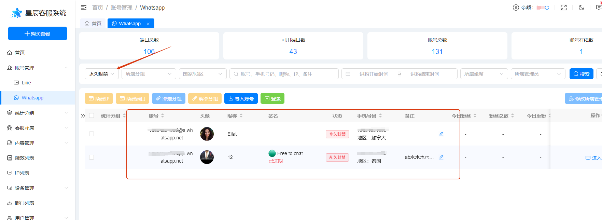
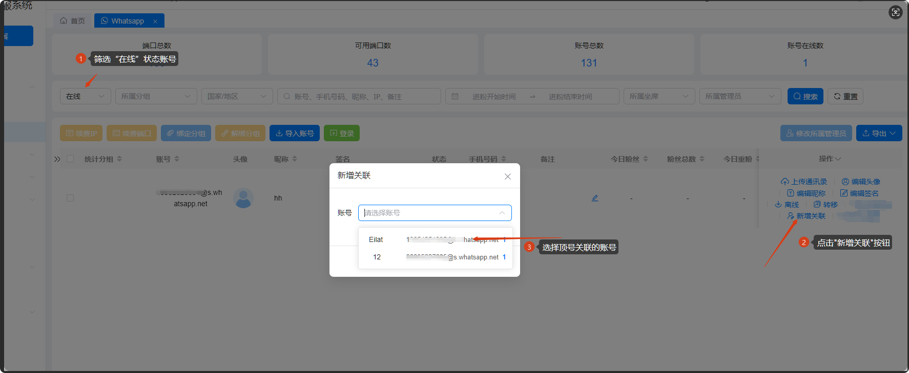
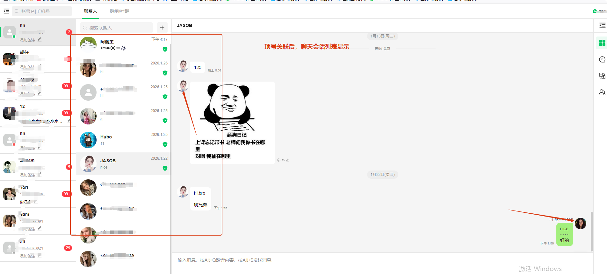
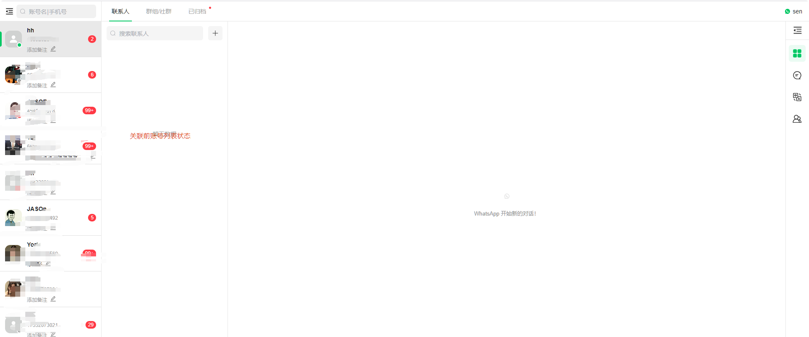
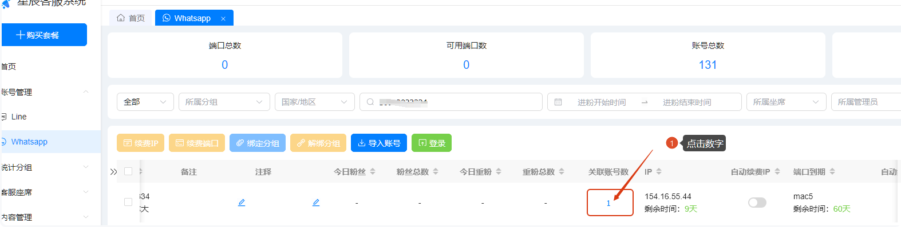
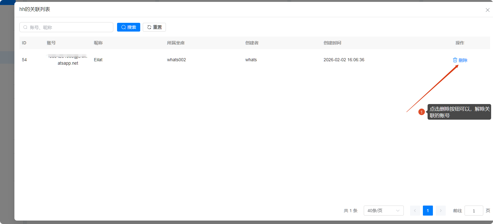

# 星辰永久封号，顶号关联教程

分类：星辰whatsapp协议优势
更新时间：2026-04-02T06:10:42.170Z

功能描述：将永久封禁的账号会话记录关联到新的账号，且一个“永久封禁”账号只能关联到一个新的账号下。

注：1、如果关联错了，解除关联在重新关联（解除关联操作在后面）2、如果没权限，找风控

关联条件：
1、有“永久封禁”状态下的账号，且有会话记录；

2、新号要绑定坐席才会出现有继承永封的功能

3、新的账号需要“在线”状态下，才可以操作顶号关联

## 操作流程

**一、顶号关联**

1、筛选“永久封禁”状态的账号，并复制需要关联的账号

2、筛选“在线”状态的账号，点击“新增关联”按钮，选择顶号关联账号（可以粘贴账号选择），点击确认。注：账号后面蓝色数字是指相同粉丝数

3、进入坐席查看关联后的数据，以下是关联前后会话列表对比

关联后（如下图）

关联前（如下图）

**二、解除顶号关联**

1、找出要解除顶号关联的账号，点击关联账号数下的数字，跳转到关联列表

2、在关联列表下，找要解除关联的账号，点击删除按钮，就可以解除关联

