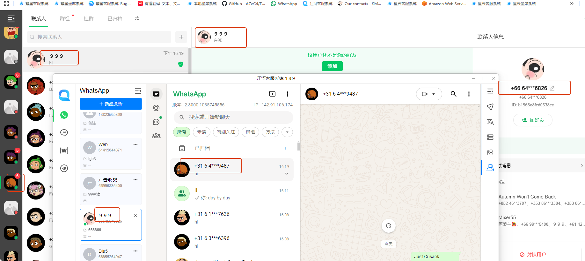
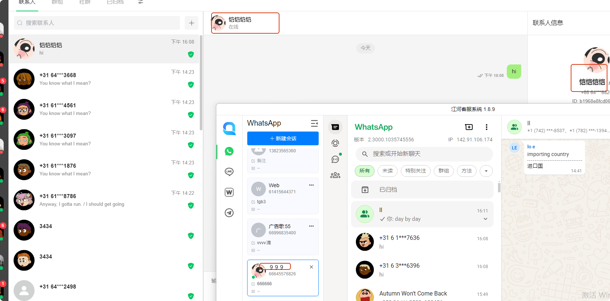
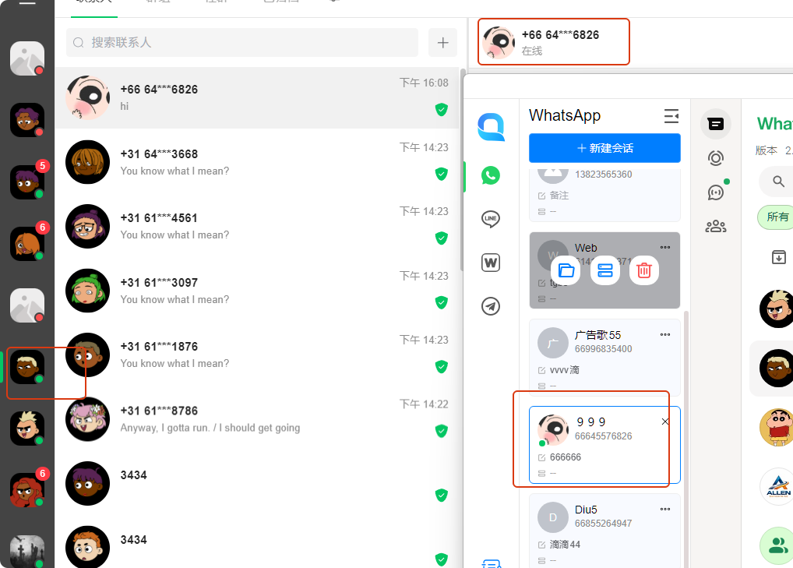

# 为什么我的呢称别的号看到的不一样

分类：星辰whatsapp协议常见问题
更新时间：2026-03-30T08:24:24.691Z

对方设置了你的名字，对方就看到你的名字；你设置了自己名字，对方只是有可能看到你的名字，看不到的人就没反应，等看到才有反应，所以你们看到的其他部分号没更新最新名字，是正常结果；A号在其他号的身份99%是号码，不论A什么时候改名字，改了多少次。

**名字显示优先级：备注 > 昵称 > 手机号码**
