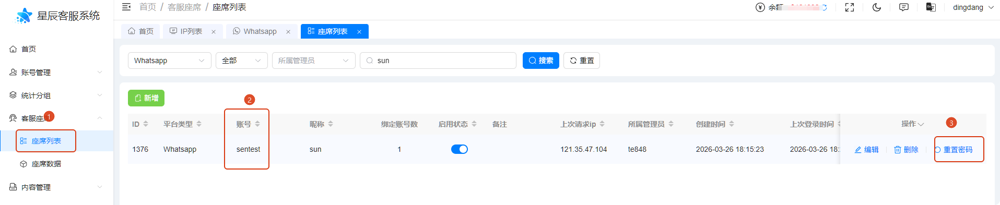
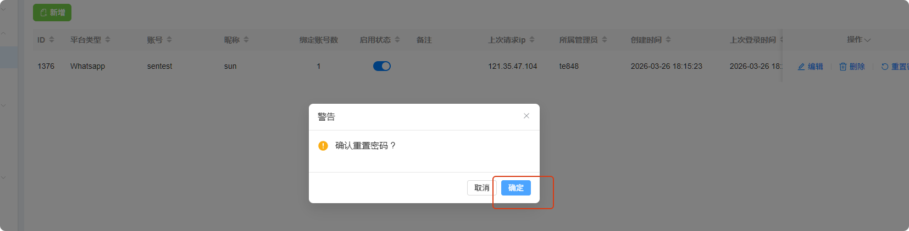
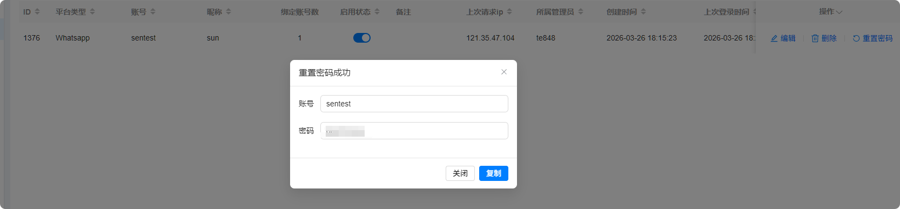
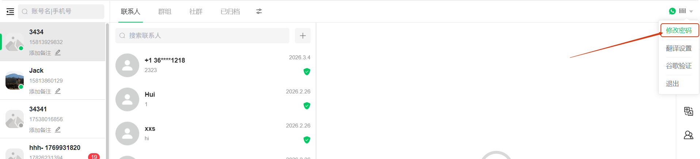
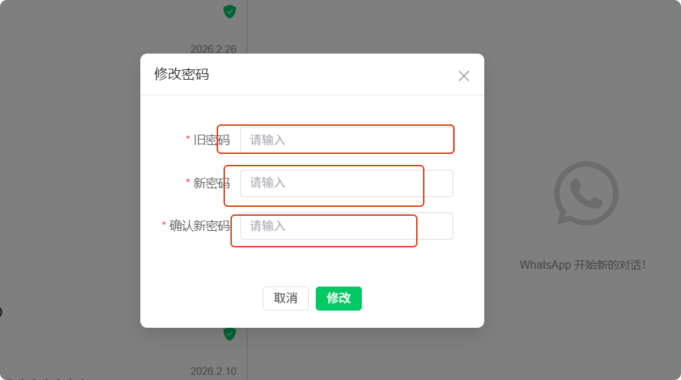

# 如何重置坐席密码且登录坐席修改密码

分类：星辰whatsapp协议常见问题
更新时间：2026-03-27T09:22:50.687Z

## 如何重置坐席密码

1、打开坐席列表，找到要重置坐席密码的账号，点击重置密码

2、点击确认按钮

3、密码重置成功，需要复制，不然关闭后就看不到了

## 登录坐席后如何修改密码

1、登录坐席后，点开账号的下拉按钮，再点击修改密码按钮

2、输入旧密码和新密码，点击修改按钮，完成修改

