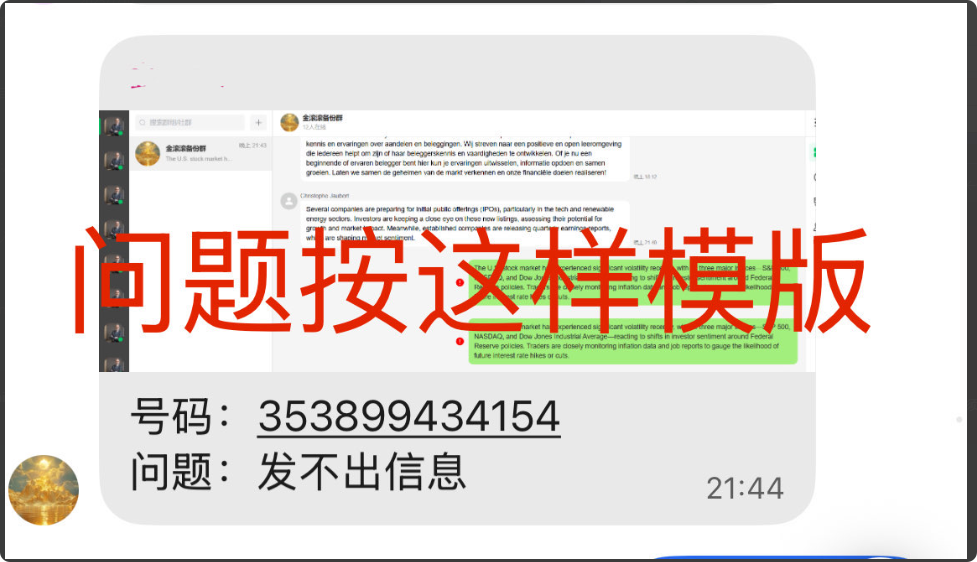

# 提问模板以及视频录制教程

分类：星辰whatsapp协议常见问题
更新时间：2026-03-25T09:32:47.295Z

涉及少于5个号码号码需要全列，多于5个号码列5个，列多少个号码带多少个号码的截图，截图必须是除了网址以下的所有界面

## 必须按格式提交，星辰必须要复现问题，才能解决问题，减少沟通成本，快速定位和处理问题。

## 不涉及号码的问题，提供坐席或者管理员

## 有些问题需要录屏可以使用PowerPoin或者LICEcap

PowerPoint 屏幕录制详细步骤 (2013及以上版本)
打开工具： 打开PowerPoint，切换到【插入】选项卡，在最右侧点击【屏幕录制】。选择区域： 点击【选择区域】，使用十字光标拖动选择需要录制的屏幕范围，也可按 Windows 徽标键 + Shift + F 全屏录制。配置录制： 控制坞上默认勾选【录制音频】和【录制指针】。如需关闭，点击对应图标即可。开始录制： 点击红色【录制】按钮，倒计时结束后开始录制。录制时可点击【暂停】或【停止】。完成与保存： 录制结束后，视频会自动显示在PPT幻灯片中。另存视频： 右键点击视频框，选择【将媒体另存为...】，保存为 .mp4 格式文件。剪辑视频： 点击视频，在【播放】选项卡中选择【剪辑视频】

LICEcap 录屏详细教程
安装与启动在官网下载LICEcap后安装，双击打开程序。软件界面是一个透明的框，框内区域即为录制范围。设置与录制调整区域： 拖动透明框的边缘或角，调整大小以覆盖需要录制的内容。点击录制： 点击右下角的 "Record"。保存文件： 弹出的窗口中设置文件名、选择保存位置，然后点击“保存”。录制过程控制录制开始后，你可以继续操作电脑，也可以直接移动或调整LICEcap的框，调整录制范围。暂停/结束： 按下 Ctrl+Alt+P 可以暂停录制，按下 "Stop" 结束录制。
