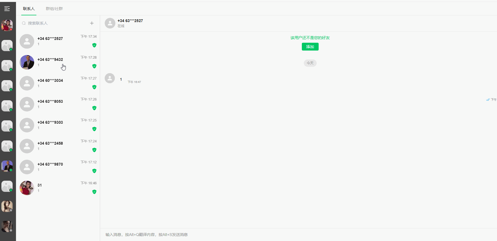
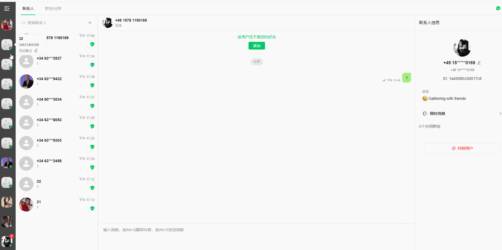

# 关于登录、登录养号、炒群前准备

分类：星辰使用建议
更新时间：2026-03-23T12:26:21.348Z

**一、登录前确定坐席要登录多少个号码，这个坐席要对所有号码按照如下操作进行登录养号，可以保证会比不做任何操作空挂，或者做自以为是的养号操作更加稳定：**

1、假设坐席要登录9个号码31-39，建10个群32-41；（业务按实际调整登录号码和建群数量）按照正常流程登录号码，并绑定坐席

2、按照图1,9个号码相互发送消息，必须严格按照图中的方式：
        2.1图中方式是每个号码以前通过搜索其中一个号码发消息，发完每个号码，改变需要发送的号码，直到每个号码两两互发消息
        2.2不允许的操作：一个号搜索其他8个号码发消息，再操作其他号码，这个操作结果跟2.1一样，但是性质完全不同，会造成频率过快，不允许
        2.3不允许的操作：不允许在这个阶段点击加好友按钮，下面注意说明会说明原因

3、开始建群，按照下图，一共需要建多少个群，平均分到每个号上，一个号一次建一个群，必须拉上几个列表中的内部成员
        3.1 不允许的操作，一个号平均要建两个群，然后一次性建两个群，这个和建议操作结果一样，但是性质完全不同，会造成频率过快，不允许
        3.2 不允许的操作：内部账号（托号、老师号不管是江河还是星辰上） 都不能通过邀请链接加群，只能按照图3，给内部账号发个主动消息，然后通过“添加成员”、“邀请-使用 WhatsApp 发送链接” 添加目标
        3.3 外部账号（客户） 不会滥用功能，不存在快速加群导致群被封的情况，所以可以通过链接邀请对方

**二、可能出现的问题说明：**

1、一中的登录创号养号经验，是星辰通过超过上万个号码的使用和超过长达1年时间的测试的经验，对账号的稳定有效果，但是不是百分百保证不封号是否采纳看团队个人

2、图1、图2举例中，出现一个账号在操作中被封禁且没有其他异常，这是属于正常情况，官方对于登录的封禁一般是会持续两天，两天内任何情况下掉号都是合理的，掉号只能申请解封复接，这样循环。再次强调，建议参考星辰的操作。

3、目前已知空挂（不干任何操作）的号码，登录3天内大概率会封号，建议按照一的方式操作，并保持每隔2个小时左右在内部群发消息，让所有挂号接收到消息，增加账号健壮性

4、目前已知创建群不拉人（建空群），群加入太快都会造成封群，或者暂时无法加群，严重甚至会封号，建议操作的方式是按照一中3操作，每个管理员星辰预留一周的使用测试的适应时间、会配合查询疑问一周，一周后再有疑问星辰不予回答，也没法回答，请自行接受结果，封号的申请解封，没封号的等一天号再做同样的操作

5、以下任何操作封号都是正常情况：
        5.1、登录三天内封号（任何正常操作，只要时间不超过都有可能被登录检测封号）
        5.2、新登录期（3天内）长时间低频使用封号（空挂号、只接粉后长时间挂机、有加群但是群消息稀少包括但不限于任何低频使用账号）
        5.3、新登录不绑定坐席（不绑坐席肯定没业务属于挂空挡）
