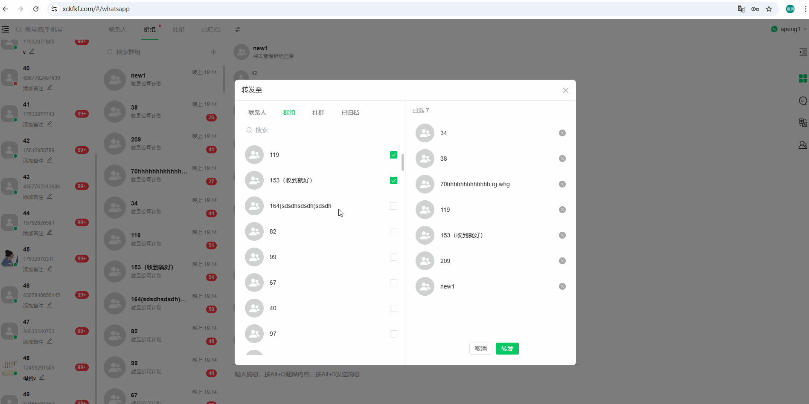
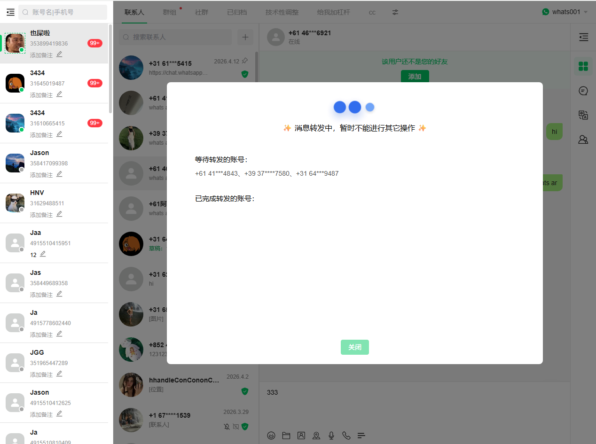

# 端对端加密消息收发功能更新通知

分类：星辰使用建议
更新时间：2026-04-15T12:01:58.592Z

**一、本次更新修复的问题**

本次更新修复以下问题：
 
  1. 星辰发送消息延迟解密问题
  客户端接收星辰发送的消息时，出现延迟且无法解密
  2. 星辰接收消息延迟解密问题
  星辰接收消息时，显示延迟且无法解密
  3. 群发消息状态不一致问题
  频繁群发时偶现发送失败提示，但对方实际已成功接收消息
  4. 频繁群发触发官方限制
  群发操作过于频繁导致账号被官方限制或封禁
  5. 挂机Key不同步导致封号问题
  长期挂机接收消息时，Key不同步导致发送消息时加解密失败，触发大量重试操作，进而导致官方限制或封号

**二、更新后注意事项**

2.1 首次群发同步机制
 
  - 现象说明： 更新后，每个账号在每个群的首次群发时，可能需要进行消息同步（取决于官方判定的账号状态）
  - 表现特征： 如需同步，第一条群发消息的发送速度会明显较慢（见图1）(其他号去接收查看会看到明显一条条消息慢慢发送的过程这是在自动修复不同步的问题)
  - 后续表现： 首次群发成功后，再次群发将恢复至正常速度

2.2 群发过程中的操作限制 ⚠️
 
  - 重要提示： 群发进行中时，请勿对该账号进行任何其他操作
  - 系统限制： 江河系统已实现群发未完成前的账号操作限制
  - 界面更新： 图2所示的界面操作限制功能预计于本周五上线

2.3 更新后可能出现的封号情况
 
  - 原因分析： 由于长期挂机导致的严重Key不同步问题，更新后部分账号被封属于预期情况
  - 处理方式： 如账号被封，按正常流程申请解封后继续使用即可，无需询问封号原因

2.4 问题反馈机制
 
  - 反馈条件： 如更新后仍出现第一部分中列出的任何问题
  - 反馈方式： 在Ant群中 @朋，并提供以下信息：
    - 问题账号
    - 具体问题描述
