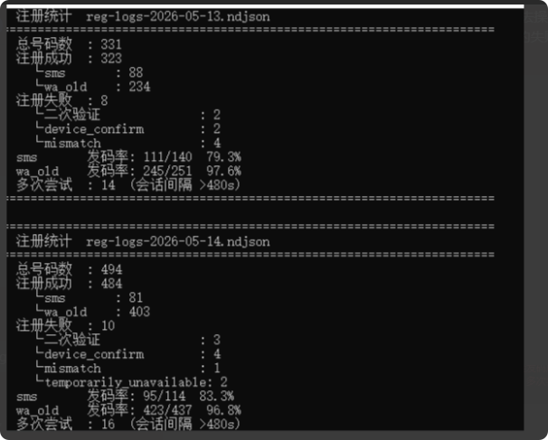
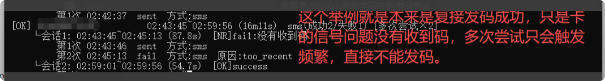

# 20260515新版星辰注册/登录测试

分类：测试结果
更新时间：2026-05-20T23:39:49+08:00
ID：4c12206ddddf3471b6e3e5c0

**本次测试结论：新版星辰注册 / 登录逻辑目前测试正常。除人为输错验证码外，注册、转移、复接失败大多来自官方限制，不是星辰流程异常。**

## 一、测试结论

新版注册 / 登录逻辑更新后，测试结果显示：

1. 正常号码可以完成注册。
2. 正常号码可以完成登录。
3. 正常号码可以完成转移。
4. 正常号码可以完成复接。
5. 失败场景主要集中在官方限制、号码风控或验证码输入错误。

## 二、失败通常是什么原因

如果出现注册、登录、转移或复接失败，常见原因如下：

1. 验证码人为输入错误。
2. 官方限制当前号码继续登录。
3. 官方限制当前号码转移设备。
4. 官方限制当前号码复接。
5. 号码处于实时风控状态。

> 说明：最终能否发码、登录、转移或复接，以 WhatsApp 官方实时返回为准。

## 三、遇到失败应该怎么处理

如果遇到失败，不建议短时间内连续重复尝试。

建议按以下间隔处理：

1. 第一次失败后，间隔半天再试。
2. 仍然失败，间隔 1 天再试。
3. 继续失败，间隔 2 天后再试。

除【代理失败，请重试】外，其他红色失败提示不要短时间多次点击重试。重复操作对发码没有帮助，反而可能加重风控。

## 四、测试截图参考

